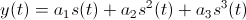

## FM Signal waveforms

### Objectives

This tutorial is a guide to FM signal waveforms. In this tutorial you
will learn:

- Theory and equations of FM signals, power spectrum, bandwidth, FM demodulation

- construct an FM transmitter flowgraph to generate an FM waveform with sinusoidal message and square wave message

- construct an FM receiver flowgraph to recover the message from the FM waveform.

### FM flowgraphs

In this first section we build flowgraphs to transmit and receive FM signals
that are simulation-only and do not (yet) use the USRP (that will come later in this lab!).

- Review the theory of [FM Signals](../_docs/pdriessen_textbook.pdf) (section 5).

- Using the following GRC files as a starting point:
  - [FM_Transmitter.grc](data/FM_Transmitter.grc)
  - [fm_receiver.grc](data/fm_receiver.grc)

- Carry out the steps in the [FM Tutorial](data/FM_procedures.pdf)

- Start GRC as was done in Lab 1.

## FM Receivers

### FM broadcast receiver

In this section, we consider a practical FM receiver that can receive
real off-air FM signals using the USRP.

- Open [this GRC flowgraph](data/wfm_rx.grc).

- Observe the flowgraph comprising various blocks and interconnections, as well as predefined variable blocks not connected to anything.
  - Blocks with blue connection points signify complex signals (I and Q), and orange connection points signify real floating point signals.
  - The USRP source block represents the USRP receiver hardware. This block outputs a complex signal that travels through various blocks (including sample rate conversion), eventually arriving at an audio sink.
  - The audio sink represents the computer's audio output hardware.

- This flowgraph implements an FM receiver.Compare this receiver to the FM receiver from the FM waveforms tutorial in the previous section.
  - What new blocks are added and what is their function?
  - Which blocks are identical or perform similar functions?

- Execute the flowgraph by first clicking the Generate button followed by the Execute button. The screen shows an FM receiver with a spectrum analyzer display and several sliders. The radio is tuned to 98.1 MHz (an FM station in Seattle), the RF gain is set to 7 and the AF gain is set to 300 m. The radio can be tuned using the sliders or the keyboard arrow keys.

- Notice the noise level is around ‐100 dBm and the signal peak level is 20‐40 dB higher than that. Notice the spectrum analyzer covers a bandwidth of 250 kHz corresponding to the half the sampling rate set for the USRP source block in the flowgraph.

### FM data receiver

- Modify the FM receiver flowgraph by replacing the FM demodulation block with the "homemade" FM demodulator using the Delay and Complex Conjugate blocks.

- Use the USRP to tune to the 2-level FSK signal at 142.17 MHz. This signal is the control channel for the [CREST public safety radio system](http://www.crest.ca/).

- Observe the demodulator output on the scope. The filter bandwidth and decimation rate may require adjustment, since the bandwidth of this CREST signal is about 25 kHz compared to 200 KHz for FM broadcast signals.

- Check the persistence box on the scope and reduce the alpha to minimum. You will observe a so-called [eye diagram](http://en.wikipedia.org/wiki/Eye_pattern) of the data, as shown below. The eye diagram shows the number of milliseconds per bit. Find the bit rate (the number of bits per second).

   
  __*Figure 2.13: Eye diagram of the data shown in a Gnu Radio Companion scope sink.*__

### Dynamic Range with FM

- Review the theory of [dynamic range](data/DynamicRange.pdf). These notes will also be useful for subsequent sections on dynamic range with IQ signals and on noise figure.

- Retune the USRP to the FM broadcast station at 98.1 MHz.

- Increase the RF gain from 7 dB to 20 dB or more.
  - Notice that the signal level increases and then suddenly both noise and signal jump up and the audio changes to a different program. What is happening is that a strong signal somewhere within the 40 MHz bandwidth of the USRP's receiver is clipping the 14 bit A/D converter in the USRP. The 14 bit A/D converter has a dynamic range of about 84 dB (14 bits times 6 dB per bit), so a signal above about ‐100 dBm + 84 dB = ‐16 dBm will clip the converter. With the RF gain set to around 20 dB, the receiver becomes non‐linear and the audio from the strong signal is cross‐modulating on top of the signal at 98.1 MHz.
  - Cross‐modulation can be shown to occur by modelling the non‐linear receiver as having the output:  (ignore higher order terms), where s(t) is the sum of the strong and the weak signal.
  - Reduce the RF gain and notice that the original signal is restored. Next, we will look for this strong signal.

- Tune the FM receiver to 101.9 MHz (the local UVic radio station CFUV). Notice that the signal level is much higher (close to ‐30 dBm). Now increase the RF gain to at least 20 dB and observe the signal level can be increased to above ‐16 dBm, however, the audio is not changed. This signal at 101.9 MHz was causing the clipping.

- Experiment more with the FM receiver. Notice that many signals can be received, FM signals are spaced every 0.2 MHz with an odd last digit, from 88.1 MHz up to 107.9 MHz.
