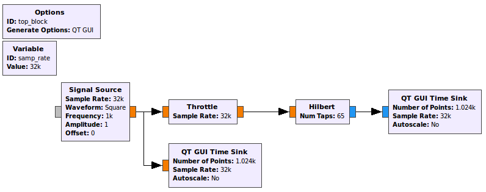
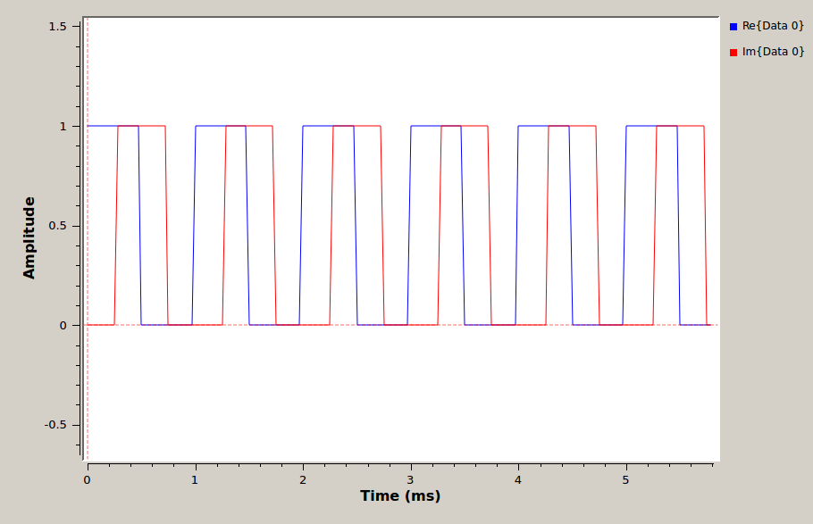

<!-- ### Hilbert Transforms

- Open a new flow graph in GRC. Create the simple flow graph shown. Set the *Type* in each of the three blocks to *Float* as you have in the past. Other than that you can leave all of the values at their default settings.

   
  __*Flow graph with simple input and throttled output.*__

- Execute the flow graph. The scope sink should open and display a sinusoidal signal. Convince yourself that this signal has the amplitude and frequency that you expect.

- Modify the flow graph by changing the *Type* in each of the three blocks to *Complex*. Execute the flow graph. Your scope plot should now display two sinusoids that are 90° out of phase with each other. The leading (*Re{Data 0}*) wave is the I or in-phase component of the complex signal and the lagging (*Im{Data 0}*) wave is the Q or quadrature component. When a signal source is set to *Complex*, it will output both the I and Q components.

- Modify your flow graph as shown below. The *Signal Source* should be set to output a Square wave with a Type of Float. Thus, the first *Scope Sink* and the *Throttle* must also be set to accept Float values.

   
  __*Flow graph with square waveform input and Hilbert filter.*__

- The [Hilbert](https://wiki.gnuradio.org/index.php/Hilbert) block is found in the *Filters* category. This block outputs both the real input signal and the Hilbert transform of the input signal as a complex signal. Leave the number of taps at its default setting of 65. Since the output of this block is complex, the second *Scope Sink* must be set to accept complex inputs.

- Execute the flow graph. Two scope plots should open. One should contain the square wave output from the *Signal Source* only. The other should include both the original square wave and its Hilbert Transform, as below.

   
  __*Output of Hilbert filtered square waveform in time domain*__

---

#### Deliverable Question 1

Why does the Hilbert transform of a square wave look this way?

---

- The *Signal Source* can be set to output a complex signal and display both the I and Q components. Modify the flow graph as shown below.

   
  __*Flow graph with a complex square wave input.*__

- Set the *Signal Source* to output a complex waveform. Make sure the *Throttle* and *Scope Sink* are also set to complex.

- Execute the flow graph. **Is the complex waveform displayed here the same as the one obtained from the Hilbert transform?** Your answer should be NO. This is incorrect. GRC is NOT displaying the correct Q component of a complex square wave. The Hilbert transform did output the proper waveform.

   
  __*Complex square wave in time domain.*__

- [Section 2.3.6 of the textbook](../_docs/pdriessen_textbook.pdf) shows how to use the Hilbert transform to demodulate SSB signals.

- You can discard this flowgraph, it is not for submission. -->
