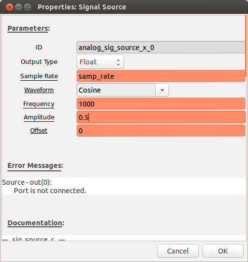
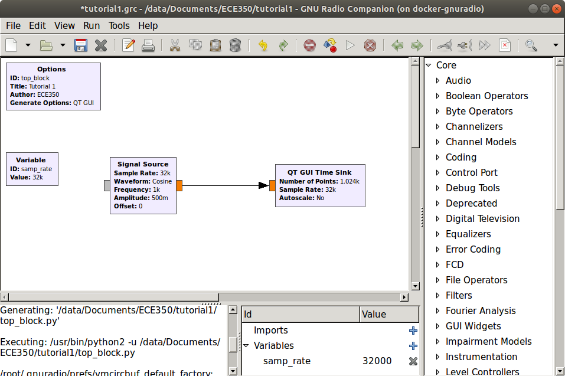
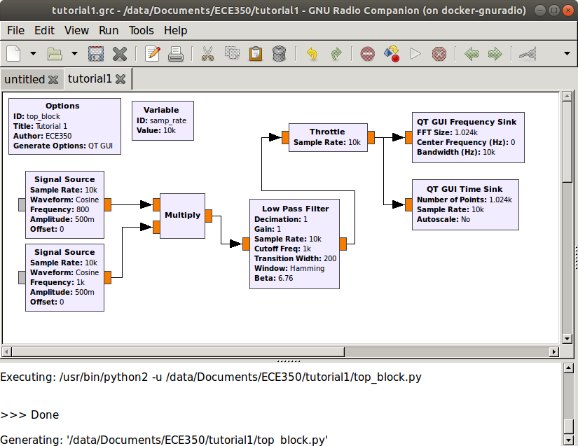

## Objectives

GNU Radio Companion (GRC) is a graphical user interface that allows you to build GNU Radio flowgraphs. It is an excellent way to learn the basics of GNU Radio. This is the first in a series of tutorials that will introduce you to the use of GRC.

In this tutorial you will learn how to:

- launch the GNU Radio Companion (GRC) software.
- create and execute a GRC flowgraph.
- use basic blocks such as signal sources and graphical sinks.
- use the computer's audio hardware with GRC.

## Launching GNU Radio Companion

Launch GNU Radio companion by selecting the three little colored dots in the bottom left hand side of the screen and searching for "gnuradio".

  
 __*Finding Gnu Radio Companion on CentOS.*__

Double-click and an untitled GRC window should open.

  
 __*Blank Gnu Radio Companion flowgraph.*__

## Configuring the Flowgraph

The *Options* block sets some general parameters for the flow graph.
Double-click on the *Options* block. You should now see a properties
dialog.

  
 __*Options block properties dialog.*__

Adjust the parameters for this tutorial:

- Leave the ID as "top_block".
- Enter "Tutorial 1" as the title.
- Enter your name as the author.
- Set Generate Options to QT GUI.
- Set Run to Autostart, and Realtime Scheduling to Off.
- Click OK to close the properties dialog.
  
The other block in the flowgraph is a [variable](https://wiki.gnuradio.org/index.php/Variable) block that sets the sample rate. Click on this block to see the variable name and value. The variable block will be discussed later in the tutorial.

## Adding Blocks to the Flowgraph

On the right side of the window is a list of the blocks that are available. By expanding any of the categories (click on triangle to the left) you can see the blocks available. Explore each of the categories so that you have an idea of what blocks are available.

You can also click on the magnifying glass (or binoculars, on some operating systems) in the upper right side of the window and simply type a search term (e.g. *receiver*) to search all categories. A small text window will appear above the list of blocks in which your search term will be entered. This will filter the list leaving only blocks with *receiver* in their name. Try a few searches such as *filter* and *source* to see what comes up.

- Open the *Waveform Generators* category and double-click on the [Signal Source](https://wiki.gnuradio.org/index.php/Signal_Source). Note that a *Signal Source* block will now appear in the main window.

- Double-click on the *Signal Source* block and the properties dialog will open. Adjust the settings to match those as shown and close the dialog. This *Signal Source* is now set to output a real-valued 1 kHz sinusoid with a peak amplitude of 0.5.

   
 __*Signal source properties.*__

- In the flowgraph, the *Signal Source* block will have an orange output tab, representing a float (real) data type. If the block settings is chosen as complex instead of float, then the output tab will be blue. In order to view this wave we need one of the graphical sinks. Expand the *Instrumentation* category and then the *QT* subcategory.

- Double-click on the [QT GUI Time Sink](https://wiki.gnuradio.org/index.php/QT_GUI_Time_Sink). It should appear in the main window. Double-click on the block and change the *Type* to *Float*. Go to the *Config* tab along the top and set:
  - Control Panel: Yes (this will allow manipulating the scope "live")
  - Line 1 Marker: Circle (this will put a circle on each sample)
  
  Click *OK* to close the properties dialog.

     
    __*Time sink properties.*__

- In order to connect these two blocks, click once on the *out* port of the *Signal Source*, and then once on the *in* port of the *Scope Sink*. The below flowgraph should be displayed.

     
    __*Scope sink flowgraph.*__

- The problem with this flowgraph is that although the sample rate is set to 32000, there is no block which enforces this sample rate. Therefore, the flowgraph will consume as much of the computer's resources as it possibly can which can cause the GRC software to lock up. To fix this problem, disconnect the *Signal Source* from the *QT GUI Time Sink* by clicking on the arrow and pressing the Delete key. Expand the *Misc* category and double-click on the [Throttle](https://wiki.gnuradio.org/index.php/Throttle). Connect this block between the *Signal Source* and the *QT GUI Time Sink* (click once on the out port of one block and the in port of the next block).

    > Note: The input and output arrowheads will change to red. This indicates a problem with the flowgraph, in this case, the data types do not match. To fix the problem, double-click the *Throttle* and change the *Type* to *Float*.

     
    __*Scope sink flowgraph with a throttle block.*__

## Executing the Flowgraph

In order to observe the operation of this simple system we must generate
the flowgraph and then execute it.

- Click first on whichever of  or  icons are available to you (or press F5) to generate the flowgraph.

- If the flowgraph has not yet been saved, a file dialog will appear when you click this button. Name this file `tutorial1.grc` and save it to a folder on your home drive. The generation stage converts your flowgraph into executable Python code.

- Click whichever of  or  icons are available to you (or press F6) to execute the flowgraph. The execution stage runs the Python code that was generated in the previous step. A scope plot should open displaying several cycles of the sinusoid. Confirm that the frequency and amplitude match the value that you expect. **What is the period of one cycle of the sine wave, and thus what is the frequency?** Experiment with the controls on the scope plot.

## Working with the Scope Sink

- Recall that the *Variable* block set the sampling rate to 32000 samples/second or 32 samples/ms. Note that there are in fact 32 samples within one cycle of the wave. Decreasing *X Max* in the control panel until 1 ms is visible will let you count the number of samples.

     
    __*Sample values shown on the scope.*__

- Close the scope and reduce the sample rate to 10000 by double-clicking on the *Variable* block and entering 10e3 in the *Value* box. Note that you can use this exponential notation anywhere that GNU Radio requires a number.

- Re-generate and execute the flow graph. Note that there are now fewer points per cycle. How low can you drop the sample rate? Recall that the Nyquist sampling theorem requires that we sample at more than two times the highest frequency. Experiment with this and see how the output changes as you drop below the Nyquist rate.

## Working with the FFT Sink

- The FFT Sink acts as a Spectrum Analyzer by doing a short time discrete Fourier transform (STFT). Review the [theory of the Spectrum Analyzer](../_docs/pdriessen_textbook.pdf) (section 1.4).

- Close the scope and change the sample rate back to 32000. Add a *QT GUI Frequency Sink* (under *Instrumentation->QT*) to your window. Change the Type to Float and leave the remaining parameters at their default values.

- Connect this to the output of the *Signal Source* by clicking on the *out* port of the *Throttle* and then the *in* port of the *QT GUI Frequency Sink*. Generate and execute the flow graph. You should observe the scope as before along with an FFT plot correctly showing the frequency of the input at 1 kHz. Note that there is no control panel for the FFT plot unless you change *Config tab->Control Pannel* to *Yes*. Close the output windows.

- Explore other graphical sinks (*QT GUI Number Sink*, *QT GUI Waterfall Sink*, and *QT GUI Histogram Sink*) to see how they display the *Signal Source*
  - The number sink is typically used to monitor slowly-changing signals such as the RMS input level. In this example, the sine wave changes too fast for the numbers to keep up.
  - The waterfall sink is used to display amplitude vs. frequency vs. time with amplitude represented as a variation in color. The waterfall is a time frequency diagram with time on the vertical axis. Note that for a single 1 kHz sine wave input, the frequency does not change with time, thus a vertical line is displayed at 1 kHz.
  - The histogram sink displays a histogram of the input values, which can be used to monitor the symbol distribution in a digital signal or the distribution of a noise source.

## Working with Audio I/O

- Create the flow graph shown below.

     
    __*Audio flow graph.*__

- The *Audio Sink* is found in the *Audio* category. The [Audio Sink](https://wiki.gnuradio.org/index.php/Audio_Sink) block directs the signal to the audio card of your computer. Note that the sample rate is set to 48000, a sample rate that is usually, but not always supported by computer audio hardware. 44100 is supported by every sound card. Other commonly-supported rates are 8000, 11025 and 22050. Some audio hardware may support higher rates such as 88200 and 96000. Also note that there is no *Throttle* block. This is because the audio hardware enforces the desired sample rate by only accepting samples at this rate.
  
    > It is worth noting that sample rates, especially related to audio output are a common source of frustration in these labs so it is worth spending some time to ensure the concepts are understood here. More information about how GNU Radio communicates with the computer's audio hardware can be found [here](https://wiki.gnuradio.org/index.php/ALSAPulseAudio).

- Generate and execute this flow graph. The graphical display of the scope and FFT should open as before. However, now you should also hear the 1 kHz tone. If you do not hear the tone, ensure that the output from the computer is connected to the speakers and that the volume is turned up. Experiment with changing both the overall sample rate in the flow graph as well as the sample rate in the audio sink to see how the tone is affected.

## Math Operations

- Construct the below flow graph. Set the sample rate to 32000. The two Signal Sources should have frequencies of 1000 and 800, respectively. The [Add](https://wiki.gnuradio.org/index.php/Add) block is found in the *Math Operators* category.

     
    __*Flow graph to add sinusoidal inputs.*__

- Generate and execute the flow graph. On the Scope plot you should observe a waveform corresponding to the sum of two sinusoids. On the FFT plot you should see components at both 800 and 1000 Hz. Unfortunately, the FFT plot does not provide enough resolution to clearly see the two distinct components. Note that the maximum frequency displayed on this plot is 16 kHz. This is one-half of the 32 kHz sample rate. In order to obtain better resolution, we can lower the sample rate. Try lowering the sample rate to 10 kHz. Recall that for an FFT, the frequency resolution *f0=fs/N* where *fs* is the sample rate and *N* is the FFT block size. Thus for fixed value of *N*, *f0* goes down as *fs* goes down.

- Replace the *Add* block with a [Multiply](https://wiki.gnuradio.org/index.php/Multiply) block. What output do you expect from the product of two sinusoids? Confirm your result on the Scope and FFT displays.

    > Note: The other math operations under the *Math Operators* category and experiment with a few to see if the result is as expected.

## Filters

- Modify the flow graph to include a [Low Pass Filter](https://wiki.gnuradio.org/index.php/Low_Pass_Filter) block as shown. This block is found in the *Filters* category and is the first Low Pass Filter listed.

     
    __*Flow graph to filter out one of two input sources.*__

- Recall that the Multiply block outputs a 200 Hz and a 1.8 kHz sinusoid. We want to create a filter that will pass the 200 Hz and block the 1.8 kHz component. This can be done with a low pass filter, whose frequency response is shown below. Double-click the block to open the properties dialog. Set the low pass filter to have a cutoff frequency of 1 kHz and a transition width of 200 Hz.
 Select the *FIR Type* to be *Float->Float (Decimating)*.

     
    __*Sample values shown on the scope.*__

- Generate and execute the flow graph. You should observe that only the 200 Hz component passes through the filter and the 1.8 kHz component is attenuated. How many dB down is the 1.8. kHz wave compared to the 200 Hz wave? Experiment with the High Pass Filter.

- Using the same flow graph, change the sample rate variable to 20000. Change the Decimation in the Low Pass Filter to 2. Decimation decreases the number of samples that are processed. A decimation factor of two means that the output of the filter will have a sample rate equal to one-half of the input sample rate, or in this case only 10000 samples/sec. This is a sufficient sample rate for the frequencies that we are dealing with. Generate and execute the flow graph. What frequency do you observe on the FFT? Measure it precisely by letting the cursor hover over the peak of the observed component.

- You should have observed that the FFT is now measuring a signal around 400 Hz, rather than the expected 200 Hz. Why is this error occurring? It is because the sample rate on the FFT has not been adjusted to properly measure its input. Double-click on the FFT Sink block and change the sample rate to samp_rate/2. Generate and execute the flow graph. You should now read the correct frequency. **It is important to be aware of the sample rate in each branch of your flowgraph.** Decimation and Interpolation options decrease and increase the sample rate respectively.

## Running Generated Python Code

- Open a file browser by clicking on the three little dots in the bottom left of the screen as shown below, and selecting "File Manager".

     
    __*Accessing home folder on CentOS.*__

- Browse to the directory that contains the GRC file that you have been working on. If you are unsure as to where this is, the path to this file is shown in the bottom portion of the GRC window. In addition to saving a `.grc` file with your flow graph, note that there is also a file titled `top_block.py`, as shown below. This is the Python file that is generated by GRC. It is this file that is being run when you execute the flow graph.

     
    __*Flow graph executable file.*__

- Double-click on this file. It will execute the program contained in the flow graph. If you want to edit the flow graph, you can double-click on the `.grc` file and it will launch GNU Radio companion.

- You can also directly modify `top_block.py` in your preferred editor and run it from a terminal window like any other python script. This allows you to use features that are not included in GRC. Keep in mind that every time you run your flow graph in GRC, it will overwrite the Python script that is generated. So, if you make changes directly in the Python script that you want to keep, save it under another name.

- To learn more about writing flowgraphs directly in Python, see this [code example](https://wiki.gnuradio.org/index.php/TutorialsWritePythonApplications).

- It is possible to change the file name of the generated Python code by changing the *ID* field in the flowgraph's *Options* block.

## Conclusions

In this tutorial, you have learned several of the basic concepts in using GRC. Make a brief list of these concepts. When you are comfortable with this material, feel free to move on to tutorial 2.

---
[**Begin Tutorial 2**](tutorial2.md)
