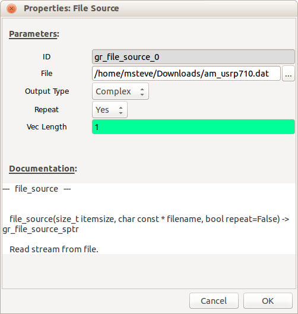
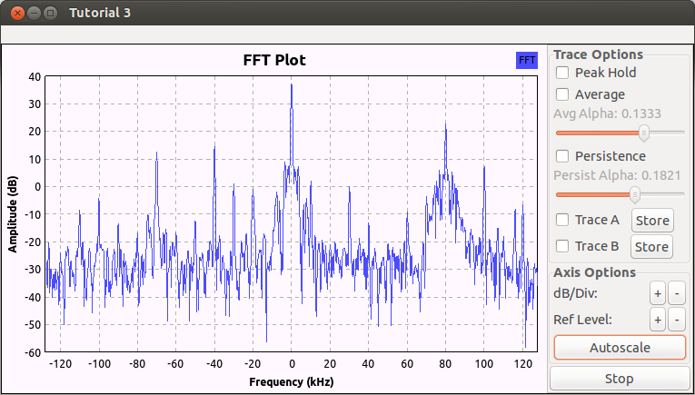
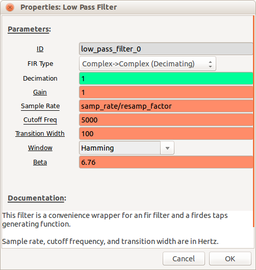
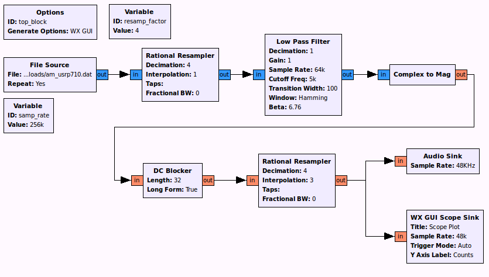
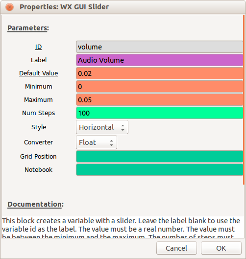
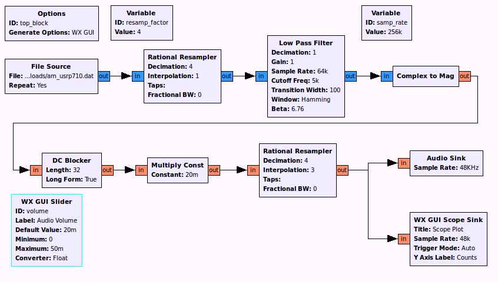

## Objectives

This tutorial is a guide to building a practical AM receiver for receiving real AM signals. You will learn how to demodulate an AM signal using only real signals. A data file with one AM signal, which will be generated using the flowgraphs in tutorial 3, will be used.

Another data file will be used that contains several seconds of recorded signals from the AM broadcast band. In this section you will learn how to:

- use a pre-recorded file as the input to your flowgraph
- tune to a specific (desired) AM signal on a given carrier frequency
- filter out the undesired signals using other (different) carrier frequencies
<!-- #TODO do we do complex in here? -->
- demodulate the desired AM signal using complex signals

---

## Tutorial 4 Deliverables

- GRC file of AM receiver with AGC as described below.
- There are 2 questions spaced throughout the lab. They are clearly indicated as they were in the last tutorial.
  <!-- - #TODO -->
  - Each question requires approximately 1 line of writing and address concepts, not details. Answer the questions and submit a single page containing the answers to your TA at the end of the lab. This should build upon your answers to the two questions posed in the last tutorial.

---

## Real signals, basic AM receiver

<!-- #TODO REMOVE -->
- Review the [theory of AM receivers using real signals](data/REMOVE_AM_theory_RX.pdf).
<!-- #TODO REMOVE -->
- Using [this file](data/AM_PB_RX.grc) as a starting point,
 carry out the steps in the [AM receiver procedures](data/AM_procedures_RX.pdf).

### Complex signals, receiver with channel selection (tuning)

- Review the [theory of AM receivers using complex signals](../_docs/pdriessen_textbook.pdf) (section 3.2).

- Click on the link below to download the data file used in this section. Save it in a location that you can access later. This file was created using a USRP receiver.
  - [am_usrp710.dat](data/am_usrp710.dat)

- Start GRC as was done in the previous tutorials. If GRC is already open, simply create a new flowgraph by selecting File->New.

#### Playing a Data File

- Construct the flow graph shown below consisting of a [File Source](http://www.ece.uvic.ca/~ece350/grc_doc/ar01s07s03.html), *Throttle*, and *WX GUI FFT Sink*. Set the sample rate in the variable block to 256000. This is the rate at which the saved data was sampled.

     
    __*Flow graph to play a file to an FFT sink.*__

- Double-click on the *File Source* block. Click on the ellipsis (...) next to the *File* entry box. Locate the `am_usrp710.dat` file that you saved in the previous step. The path to your file will appear in the block properties. Set the *Output Type* to *Complex*. The use of complex data to describe and process waveforms in SDR will be discussed in the next tutorial. Set *Repeat* to *Yes*. This will cause the data to repeat so that you have a continuously playing signal.

     
    __*File source properties dialog.*__

- Save and execute the flow graph. You should observe an FFT display similar to the one shown below. You may need to click on *Autoscale* button to scale the output. Note the following:
  
  - This data was recorded with a USRP set to 710 kHz. Thus, the signal you see at the center (indicated as 0 kHz) is actually at 710 kHz. Similarly, the signal at 80 kHz is actually at 710 kHz + 80 kHz = 790 kHz.
  - The display spans a frequency range from just below -120 kHz to just above 120 kHz. This exact span is 256 kHz, which corresponds to the sample rate that the data was recorded at.
  - The peaks that you observe on this display correspond to the carriers for AM broadcast signals. You should also be able to observe the sidebands for the stronger waveforms.

     
    __*GUI chooser properties dialog.*__

#### Frequency Display Resolution

In this step we will expand the frequency scale on the FFT display so
that you can view the signals with greater resolution. Recall from the
previous tutorial that the span of the frequency axis is determined by
the sample rate (256 kHz for this file). While we cannot change the
original data, we can resample it to either increase or decrease the
sample rate. We will decrease the sample rate by using decimation.
Modify the flow graph as follows:

- Add a *Variable* block (under *Variables* category). Set the ID to resamp_factor and the Value to 4.

     
    __*Variable properties dialog.*__

- Add the *Rational Resampler* block from the *Filters* menu as shown below. Set its decimation factor to resamp_factor. It will use the value of the variable set in the previous step (4) to decimate the incoming data. That means that it will divide the incoming data rate by the decimation factor. In this example, the incoming 256K samp/sec data will be converted down to 256K/4 = 64K samp/sec.

- Note that the *Throttle* and *FFT Sink* now need their sample rates changed to correspond to this new rate. Change the sample rate in both of these blocks to samp_rate/resamp_factor. Now we can change the decimation factor in the *Variable* block and it will be reflected in each of the other blocks automatically.

- Your flow graph should now appear as shown below.

     
    __*Flow graph with file input and decimated FFT sink output.*__

- Execute the new flow graph. You should now observe a frequency span of only 64 kHz (-32 kHz to +32 kHz). What actual frequency range does this correspond to?

#### Selecting one channel by filtering

The bandwidth of an AM broadcast signal is 10 kHz (+/- 5 kHz from the
carrier frequency). You may find it useful to click the *Stop* button on
the FFT plot to see this more clearly. Also, note that many stations
also include additional information outside of the 10 kHz bandwidth.

In order to select the station at 710 kHz (0 kHz on the FFT display) we
need to insert a filter to eliminate all but the one station that we
want to receive. This is often referred to as a channel filter. Since
the station at 710 kHz has been moved to 0 kHz (in the USRP) we will use
a low pass filter. The station bandwidth is 10 kHz, so we will use a low
pass filter that cuts off at 5 kHz.

- Insert the [Low Pass Filter](http://www.ece.uvic.ca/~ece350/grc_doc/ar01s12s01.html) (from the *Filters* menu) between the [Rational Resampler](http://www.ece.uvic.ca/~ece350/grc_doc/ar01s12s07.html) and the *Throttle*. Set the parameters as shown.

     
    __*Low pass filter properties dialog.*__

- Execute the flow graph. You should see that only the station between +/- 5 kHz remains.

#### AM Demodulation

The next step is to demodulate the signal. In the case of AM, the
baseband signal is the envelope or the magnitude of the modulated
waveform. GNU Radio contains a *Complex to Mag* block (in the *Type
Converters* category) that can be used for this purpose. Again, the use
of complex signal representation will be dealt with in depth in the
future.

- Insert the [Complex to Mag](http://www.ece.uvic.ca/~ece350/grc_doc/ar01s11s06.html) block between the *Low Pass Filter* and the *Throttle*.

  > Note: The titles of some of the blocks are now red and the Execute Flow Graph icon is dimmed. This indicates an error. Prior to adding this block, all of the block inputs and outputs were complex values. However, the output of the *Complex to Mag* block is *Float* (a real number). Thus, any blocks following this block should be Type: Float. **Modify the *Throttle* and *WX GUI FFT Sink* accordingly**.

- Execute the flow graph. You should now observe the spectrum of the baseband signal in the *FFT Sink*. Note that since the input data type to the *FFT Sink* is Float, only the positive frequency spectrum is displayed.

#### Matching the Audio Sample Rate

The next step is to listen to this demodulated waveform to confirm that
it is in fact receiving the baseband signal.

- Remove the *Throttle* and the *FFT Blocks*.

- Add an *Audio Sink* block to the output of the *Complex to Mag* block. Set the sample rate of the *Audio Sink* to 48 kHz.

- Note that the sample rate out of the *Complex to Mag* block is 64 kHz and the input to the *Audio Sink* is 48 kHz. In order to convert 64 kHz to 48 kHz we need to divide (decimate) by 4 and multiply (interpolate) by 3. Insert a *Rational Resampler* between the *Complex to Mag* and *Audio Sink* blocks and set the decimation and interpolation as noted above. Also set its Type to *Float->Float (Real Taps)*.

- Since the output of the *Complex to Mag* is always positive, there will be a DC offset on the audio signal. The signal going to the audio hardware should not have any DC offset. Place a [DC Blocker](http://www.ece.uvic.ca/~ece350/grc_doc/ar01s12s05.html) (in the *Filters* category) between the *Complex to Mag* block and the *Rational Resampler* added in the previous step.

- Place a *WX GUI Scope Sink* at the output of the *Rational Resampler* (in addition to the *Audio Sink*). Change its Type to Float and set its sample rate to 48000. The flow graph should be similar to the one shown below.

     
    __*Flow graph with file source with a "cleaner" audio output.*__

- Execute the flow graph. The *WX GUI Scope Sink* should open and display the output waveform. However, you may not yet hear the audio from your speaker or it may be very distorted. This is due to the fact that the values of the samples going in to the *Audio Sink* block are outside the range expected by the *Audio Sink*. The *Audio Sink* requires that the sample values are between -1.0 and 1.0 in order to play them back through the audio hardware.

#### Adding a Volume Control

- Insert a [Multiply Const](http://www.ece.uvic.ca/~ece350/grc_doc/ar01s08s05.html) block from the *Math Operators* category between the *DC Blocker* and the *Rational Resampler*. Set the IO Type of the block to Float.

- Add a *WX GUI Slider* block. Set the parameters as shown.

     
    __*GUI slider properties dialog.*__

- Set the constant in the *Multiply Const* block to "volume" so that the slider controls it. The final flow graph is shown.

     
    __*Flow graph with a GUI volume control to resample and play audio.*__

- Execute the flow graph. You should now hear the demodulated AM signal. Stop the flowgraph.

- Double click on the *Low Pass Filter*. Note that it can also decimate. Change the decimation in the *Low Pass Filter* block to resamp_factor and set the sample rate back to samp_rate. Remove the *Rational Resampler* between the *File Source* and the *Low Pass Filter*. The filter now handles both operations. Test the receiver again.

#### Tuning to a desired station (channel)

- Review the [theory of tuning to a radio station](../_docs/pdriessen_textbook.pdf) (section 3.2.2).

- Place an *FFT Sink* at the output of the *File Source*, leaving the rest of the flow graph unchanged.

- Execute the flow graph and observe the location of the other stations in the spectrum. Note that there is a fairly strong signal at 80 kHz (really 710 + 80 = 790 kHz).

- In order to receive this signal we need to shift it down to zero frequency so that it will pass through the low pass filter. One way to accomplish this is to multiply it by a sinusoid. Modify the flow graph as shown below. Add a *Signal Source* and set its parameters to output a cosine at a frequency of -80000. This negative frequency will shift the entire spectrum to the left by 80 kHz. Use a *Multiply* block and move the *FFT Sink* to observe its output. Test this receiver.

     
    __*Flow graph to play audio and with an FFT sink on the input.*__

- Add another *WX GUI Slider* so that you can adjust the frequency with a slider. Set the minimum to (-samp_rate/2) and the maximum to (samp_rate/2). Test your flow graph and demonstrate that it works. You may need to adjust your volume slider for each station. This is because the stations are at varying distances away from the receiver and have different transmitted power. (Remember the link equation?)

#### Automatic Gain Control

The volume adjustment can be automated with an [Automatic Gain Control
(AGC) block](http://www.ece.uvic.ca/~ece350/grc_doc/ar01s01s01.html).
This block works by sampling its own output and adjusting its gain to
keep the average output at a particular level.

- Insert the *AGC* block (found under *Level Controls*) between the *Low Pass Filter* and the *Complex to Mag* block. The *AGC* will adjust the gain so that the sample values are always in a suitable range for the audio hardware. Leave the parameters at their default values.

- You can now remove the *Multiply Const* and volume slider. Test the receiver again. Adjust the volume to a comfortable level using the computer's volume control on the first station you hear. Now tune up and down the band and notice that you no longer need to adjust the volume, but the noise level increases for weaker stations. The radio functions the same as a hardware radio.

[**Continue to Lab 2**](../_lab2/introduction.md)
