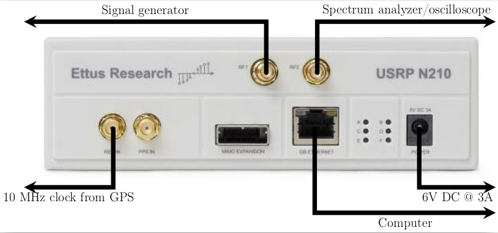
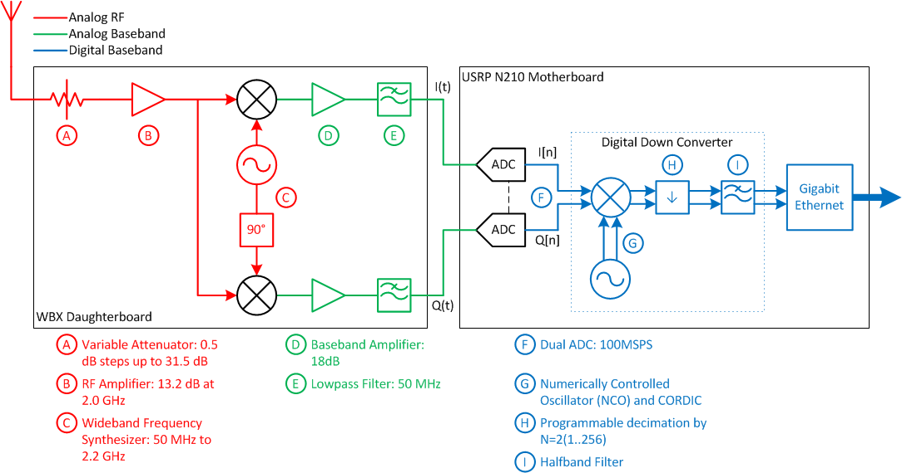
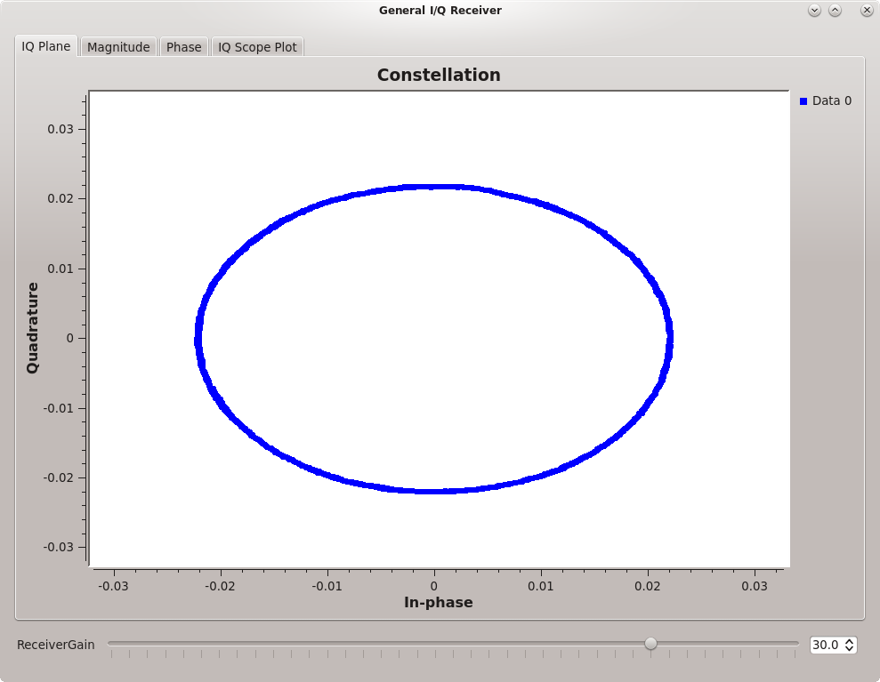
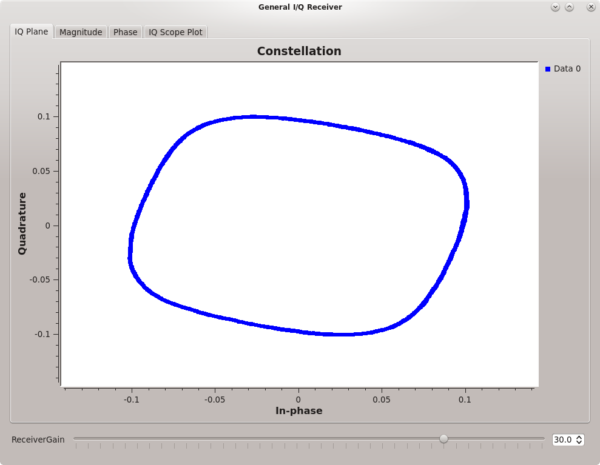
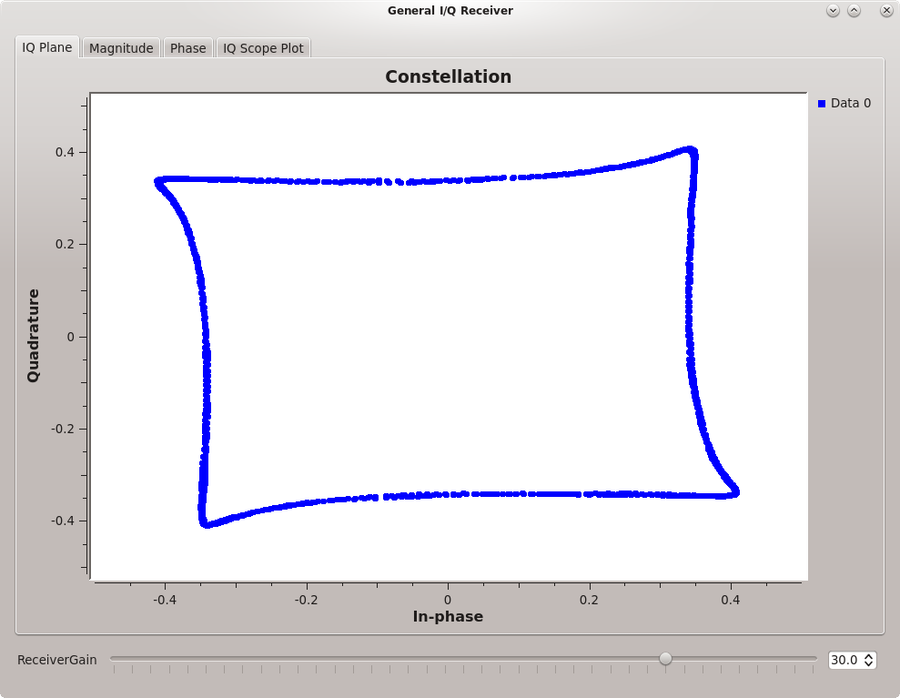

[**Back to Lab 2 Intro**](introduction.md) | [**Begin Part 2**](SSB-receiver.md)

## Objectives

This part of the lab will guide you through receiving and transmitting signals using a USRP software-defined radio. While using the USRP as a receiver you will learn about:

- frequency offsets
- USRP clock sources and reference signal synchronization
- dynamic range andclipping.

While transmitting with the USRP, you will:

- see the effect of transmitting real signals, as well as complex signals
- explore the minimum and maximum power output from the USRP
- measure the power of the USRPs transmission using both an oscilloscope and a spectrum analyzer

---

## Part 1 Deliverables
<!-- #TODO update -->
- There are several questions in this part of the lab. They are clearly indicated.
  - Each question requires approximately 1 line of writing and addresses concepts, not details. Answer the questions and submit a single page containing the answers to your TA at the end of the lab.

---

## Setup

The small grey box is the USRP software‐defined radio. The USRP digitally downconverts the received (Rx) input signal into I/Q format and sends it via Ethernet to the computer. The USRP also digitally upconverts an I/Q signal from the computer to an RF signal at the transmitter (Tx) output. The USRP's Rx input is connected to a VHF (Very High Frequency) antenna on the ELW roof. The Tx output can be connected to the oscilloscope and spectrum analyzer.

- Verify that the USRP at your station is connected as shown below. If it does not, there are BNC connector cables available at the front of the lab.
<!-- #TODO add ref clock -->
   
  __*USRP front panel*__

## I/Q Receiver

For detailed information on the usage of the USRP, you can find the data sheet and user manual as well as the range of compatible daughterboards at the [Ettus website for the USRP N210](https://www.ettus.com/product/details/UN210-KIT).

Refer to the following block diagram to understand the receive path of the USRP as it is set up in the lab. The USRPs in the lab have the WBX daughtercard installed which feature a programmable attenuator, programmable local oscillator and analog I/Q mixer. The WBX daughterboard is an analog front end for the GNU Radio software. It consists of a local oscillator implemented as a wideband frequency synthesizer, thus allowing the USRP to receive signals in the range from 50 MHz to 2.2 GHz. The WBX Daughterboard performs complex downconversion of a 100 MHz slice of spectrum in the 50-2200 MHz range down to -50 to +50 MHz range for processing by the USRP motherboard.

 
__*USRP block diagram.*__

The main function of the USRP motherboard is to act as a [Digital Downconverter (DDC)](http://en.wikipedia.org/wiki/Digital_down_converter). The motherboard implements a digital I/Q mixer, sample rate converter and lowpass filter. The samples are then sent to the host PC over a gigabit ethernet link.

### I/Q Receiver output

- Review [IQ theory](../_docs/pdriessen_IQ.pdf).

- Download and open the GRC file [general-IQ-from-USRP.grc](data/general-IQ-from-USRP.grc).

  - The USRP source does all of the operations in red, green and blue from the figure above. It outputs the complex signal ***I(t) + jQ(t)***.
  - This output is connected to 4 blocks that extract the magnitude, phase, real and imaginary parts of the complex signal, as well as a constellation scope.
  - The USRP source is tuned to a fixed frequency of 200 MHz, i.e. the LO frequency synthesizer in the WBX daughtercard is set to 200 MHz.

- Double‐click the USRP source block to bring up a window with all of the USRP parameters. This general I/Q receiver is set up to receive a signal in a range around 200 MHz at level -10 dBm from the signal generator at the back of the lab.

- Execute the flowgraph. Observe the Output Display window with 4 tabs labelled **IQ Plane, Magnitude, Phase** and **IQ Scope Plot**.

  - The Scope Plot tab should show a circle
  - Magnitude will show a (noisy) DC level
  - Phase will show a phase ramp wrapping between -π and π (saw-tooth wave) with a period that is the reciprocal of the frequency offset (fb)
  - Real and Imaginary will show (noisy) sine waves.

  > Change the *X Max* parameter and use the *Autoscale* button on some of the plots to get a cleaner display.

- Determine the frequency *fb* of the sine waves using the Phase display as well as the Real and Imaginary displays by placing your mouse cursor over the scope plot to show the time offset at different points on the waveform as in the figure below.

   
  __*Phase ramp showing frequency offset*__

- This frequency *fb* represents the offset between the received RF signal *fc* and the USRP local oscillator *fLO*, so that

  ***fb = fc - fLO***

  The input RF signal is described by:

    ***s(t) = a(t)ejϕtej2πfct = a(t)cos[2πfct+ϕ(t)] + ja(t)sin[2πfct+ϕ(t)]***

  The local oscillator is described by:

    ***e-jπfLOt = cos2πfLOt-jsin2πfLOt***

  When the two are multiplied, and *fb = fc - fLO* is substituted:

    ***I(t) = a(t)cos[2πfbt + ϕ(t)]***
    ***Q(t) = a(t)sin[2πfbt + ϕ(t)]***

  This is how you are able to read *fb directly off of the phase ramp.

  - Confirm that *fb* is as expected (ask your TA for *fc*)
  - To find *fc*, ask your TA or go check the signal generator at the back of the lab.

- The USRP source block has the *Clock Source* set to use an *External* 10 MHz clock reference frequency, and the same external reference is used for the signal generator. Thus the frequency difference between the USRP source block (local oscillator) and signal generator RF frequency will be observed to be exactly as expected from their respective frequency settings.

  - If we change the USRP source block to use an *Internal* clock reference, then expect to observe some frequency error between the signal generator and the USRP frequency settings as they are running from independent oscillators.
  - Try changing the USRP clock source to *Internal* and repeat the frequency measurement of the I and Q outputs. You will see the frequency drifting over time.

### Dynamic range with IQ signals

- Ask the TA to vary the 200 MHz signal generator level from ‐10 dBm (dB relative to one milliwatt) to 10 dBm in 1 dB steps. Some of the steps are shown in the figures below.

- Observe and describe how the signals look at each signal level, and explain why.
  >The waveform appearance results from clipping in the 2 ADCs (one ADC for I, one ADC for Q).

   
  __*Round constellation plot showing no clipping in the ADCs*__

   
  __*Squashed constellation plot showing some clipping in the ADCs*__

   
  __*Square constellation plot showing extreme clipping in the ADCs*__

---

#### Deliverable Question 1

Why do you see the constellation plot of the I/Q plane get squashed from a circle into a square as you increase the power of the received signal?

---

Look at the plot of the phase now. **Why does the phase ramp become a staircase? How does this relate to the constellation diagram?**

## IQ Transmitter

### Carrier wave transmission

In this section, we test the transmit functions of the USRP that we can use later when building a communications system. We will observe the transmitted spectrum, minimum and maximum power level in dBm. You will use both the osciloscope and the spectrum analyzer at your bench to view and measure the output from the USRP transmitter.

- Review the theory of [spectrum analyzers](../_docs/pdriessen_textbook.pdf) (section 1.4)
  > For more detailed information, you may also wish to review [Spectrum Analyzer Basics](../_docs/5965-7920E.pdf) and [The Basics of Spectrum Analyzers](../_docs/spec_analyzer.pdf). **The concepts presented here will be applicable to any spectrum analyzer you may use in your career.**

- Download and open [this GRC file](data/tx_carrier.grc).

- Observe that the USRP sink center frequency is set to 50 MHz. This block represents the USRP transmitter hardware.

- Observe that the sine and cosine signal sources are configured for 10 kHz.

- Connect the USRP Tx output to the spectrum analyzer and execute the flowgraph. A scope display will come up along with three buttons that allow you to select different values for Q(t).

- Set the spectrum analyzer's center frequency to 50 MHz and the span to 50 kHz by using the FREQUENCY and SPAN buttons. Adjust the LEVEL as necessary.

- What do you observe on the spectrum analyzer display with Q(t) = 0? Try the other two options for Q(t). What do you observe on the spectrum analyzer?

---

#### Deliverable Question 2

The GRC flowgraph shows a complex stream getting fed into the USRP. How come when **Q(t)=0** a real spectrum is shown on the spectrum analyzer?

---

### USRP power levels

- What is the minimum and maximum signal power output from the USRP? The USRP output power level can be set via the *QT GUI Range Widget* seen when running the flowgraph.

---

#### Deliverable Question 3

Why, when the USRP is active in transmit-mode, is its minimum output power greater than 0?

---

<!-- - Measure the power using both the oscilloscope and spectrum analyzer and verify they are the same.
  - Recall from your circuit theory that the output power is relative to the load impedance.
  - On the spectrum analyzer, the input is 50 Ω, which matches the expected impedance of a typical antenna. The input to the scope on the other hand is high impedance, effectively open circuit, to prevent damage to the internal circuits.
  - To compare measurement on the scope to that of the spectrum analyzer, the line from the USRP transmitter *should* be terminated with a 50 Ω terminator.
    - Alternatively, some circuit theory can be applied to determine the equivalent power output measured across an open circuit and a 50 Ω load.

    > Equation 1.5 in [the textbook](../_docs/pdriessen_textbook.pdf) shows that with a 50 Ω source and load impedance, **PdBm = 20logV + 13**.

---

#### Deliverable Question 4

Show that measuring the power from either the spectrum analyzer or the oscilloscope yields the same result.

--- -->

## Deliverables

From this part of the lab keep the following files to submit to your TA:

- The answers to [Question 1](#deliverable-question-1), [Question 2](#deliverable-question-2), [Question 3](#deliverable-question-3)

---

[**Back to Lab 2 Intro**](introduction.md) | [**Begin Part 2**](SSB-receiver.md)
