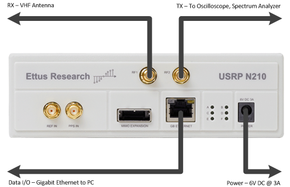
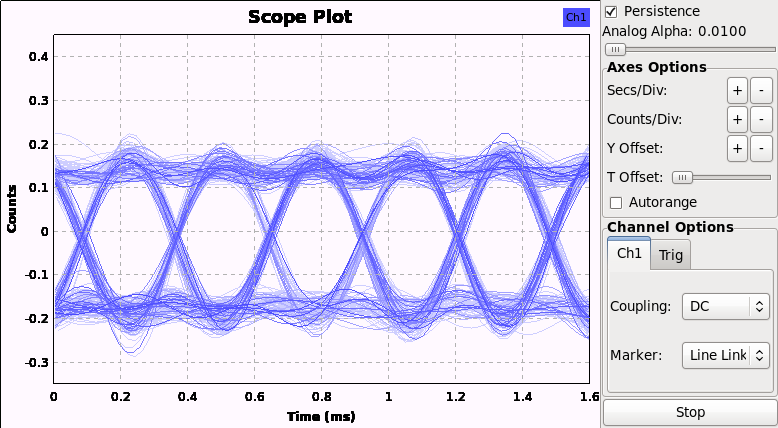

# Lab 2  - FM, IQ and USRP Tutorial

In this section you will use the Universal Software Radio Peripherial (USRP) for both receiving and transmitting signals. The USRP is a I/Q receiver with wide bandwidth (100 MHz sampling rate), programmable center frequency, programmable gain and choice of sample rates.

For detailed information on the usage of the USRP, you can find the data sheet and user manual as well as the range of compatible daughterboards at the [Ettus website for the USRP N210](https://www.ettus.com/product/details/UN210-KIT).

Refer to the below block diagram to understand the receive path of the USRP as it is set up in the lab. The USRPs in the lab have the WBX daughtercard installed which feature a programmable attenuator, programmable local oscillator and analog I/Q mixer. The WBX daughterboard is an analog front end for the GNU Radio software. It consists of a local oscillator implemented as a wideband frequency synthesizer, thus allowing the USRP to receive signals in the range from 50 MHz to 2.2 GHz. The WBX Daughterboard performs complex downconversion of a 100 MHz slice of spectrum in the 50-2200 MHz range down to -50 to +50 MHz range for processing by the USRP motherboard.

 
__*Figure 2.1: USRP block diagram.*__

The main function of the USRP motherboard board is to act as a [Digital Downconverter (DDC)](http://en.wikipedia.org/wiki/Digital_down_converter). The motherboard implements a digital I/Q mixer, sample rate converter and lowpass filter. The samples are then sent to the host PC over a gigabit ethernet link.

We will first learn about FM waveform generation and reception in software simulation-only without the URSP, then FM receiver implemented with the USRP, general IQ receiver implemented with the USRP, and finally the USRP transmit function.

## Deliverables

1. FM flowgraphs
    - GRC files of FM transmitter and receiver showing FM transmitted waveforms, spectra and FM receiver output.

2. USRP with FM
    - Observations on practical FM receiver operation using live off-air signals
    - bit rate of FSK signal at 142.17 MHz
    - Estimate of URSP receiver dynamic range with FM signals

3. USRP with general IQ signals

    - Estimate of the USRP receiver noise figure.
    - IQ receiver measured frequency offset
    - Observations of I and Q at different signal levels and effect of dynamic range
    - USRP spectrum, minimum and maximum output power

## Setup

The small grey box is the USRP software‐defined radio. The USRP
digitally downconverts the received (Rx) input signal into I/Q format
and sends it via Ethernet to the computer. The USRP also digitally
upconverts an I/Q signal from the computer to an RF signal at the
transmitter (Tx) output. The USRP's Rx input is connected to a VHF
antenna on the ELW roof. The Tx output can be connected to the
oscilloscope and spectrum analyzer.

- Verify that the USRP at your station is connected as shown in [figure_title](#usrp_connect).

   
  __*Figure 2.2: USRP front panel.*__

## FM Signal waveforms

### Objectives

This tutorial is a guide to FM signal waveforms. In this tutorial you
will learn:

- Theory and equations of FM signals, power spectrum, bandwidth, FM demodulation

- construct an FM transmitter flowgraph to generate an FM waveform with sinusoidal message and square wave message

- construct an FM receiver flowgraph to recover the message from the FM waveform.

### FM flowgraphs

In this first section we build flowgraphs to transmit and receive FM signals
that are simulation-only and do not (yet) use the USRP (that will come later in this lab!).

- Review the theory of [FM Signals](../_docs/pdriessen_textbook.pdf) (section 5).

- Using the following GRC files as a starting point:
  - [FM_Transmitter.grc](data/FM_Transmitter.grc)
  - [fm_receiver.grc](data/fm_receiver.grc)

- Carry out the steps in the [FM Tutorial](data/FM_procedures.pdf)

- Start GRC as was done in Lab 1.

## FM Receivers

### FM broadcast receiver

In this section, we consider a practical FM receiver that can receive
real off-air FM signals using the USRP.

- Open [this GRC flowgraph](data/wfm_rx.grc).

- Observe the flowgraph comprising various blocks and interconnections, as well as predefined variable blocks not connected to anything.
  - Blocks with blue connection points signify complex signals (I and Q), and orange connection points signify real floating point signals.
  - The USRP source block represents the USRP receiver hardware. This block outputs a complex signal that travels through various blocks (including sample rate conversion), eventually arriving at an audio sink.
  - The audio sink represents the computer's audio output hardware.

- This flowgraph implements an FM receiver.Compare this receiver to the FM receiver from the FM waveforms tutorial in the previous section.
  - What new blocks are added and what is their function?
  - Which blocks are identical or perform similar functions?

- Execute the flowgraph by first clicking the Generate button followed by the Execute button. The screen shows an FM receiver with a spectrum analyzer display and several sliders. The radio is tuned to 98.1 MHz (an FM station in Seattle), the RF gain is set to 7 and the AF gain is set to 300 m. The radio can be tuned using the sliders or the keyboard arrow keys.

- Notice the noise level is around ‐100 dBm and the signal peak level is 20‐40 dB higher than that. Notice the spectrum analyzer covers a bandwidth of 250 kHz corresponding to the half the sampling rate set for the USRP source block in the flowgraph.

### FM data receiver

- Modify the FM receiver flowgraph by replacing the FM demodulation block with the "homemade" FM demodulator using the Delay and Complex Conjugate blocks.

- Use the USRP to tune to the 2-level FSK signal at 142.17 MHz. This signal is the control channel for the [CREST public safety radio system](http://www.crest.ca/).

- Observe the demodulator output on the scope. The filter bandwidth and decimation rate may require adjustment, since the bandwidth of this CREST signal is about 25 kHz compared to 200 KHz for FM broadcast signals.

- Check the persistence box on the scope and reduce the alpha to minimum. You will observe a so-called [eye diagram](http://en.wikipedia.org/wiki/Eye_pattern) of the data, as shown below. The eye diagram shows the number of milliseconds per bit. Find the bit rate (the number of bits per second).

   
  __*Figure 2.3: Eye diagram of the data shown in a Gnu Radio Companion scope sink.*__

### Dynamic Range with FM

- Review the theory of [dynamic range](data/DynamicRange.pdf). These notes will also be useful for subsequent sections on dynamic range with IQ signals and on noise figure.

- Retune the USRP to the FM broadcast station at 98.1 MHz.

- Increase the RF gain from 7 dB to 20 dB or more.
  - Notice that the signal level increases and then suddenly both noise and signal jump up and the audio changes to a different program. What is happening is that a strong signal somewhere within the 40 MHz bandwidth of the USRP's receiver is clipping the 14 bit A/D converter in the USRP. The 14 bit A/D converter has a dynamic range of about 84 dB (14 bits times 6 dB per bit), so a signal above about ‐100 dBm + 84 dB = ‐16 dBm will clip the converter. With the RF gain set to around 20 dB, the receiver becomes non‐linear and the audio from the strong signal is cross‐modulating on top of the signal at 98.1 MHz.
  - Cross‐modulation can be shown to occur by modelling the non‐linear receiver as having the output:  (ignore higher order terms), where s(t) is the sum of the strong and the weak signal.
  - Reduce the RF gain and notice that the original signal is restored. Next, we will look for this strong signal.

- Tune the FM receiver to 101.9 MHz (the local UVic radio station CFUV). Notice that the signal level is much higher (close to ‐30 dBm). Now increase the RF gain to at least 20 dB and observe the signal level can be increased to above ‐16 dBm, however, the audio is not changed. This signal at 101.9 MHz was causing the clipping.

- Experiment more with the FM receiver. Notice that many signals can be received, FM signals are spaced every 0.2 MHz with an odd last digit, from 88.1 MHz up to 107.9 MHz.

## I/Q Receiver

### I/Q Receiver output

- Review [IQ theory](../_docs/pdriessen_textbook.pdf) (sections 1.2 and 1.3).

- Open the GRC patch [ra5.grc](data/ra5.grc). This flowgraph implements the mathematics on the last page of the IQ theory document.
  - The USRP source does IQ downconversion on the WBX daughtercard and outputs the complex signals I(t) + jQ(t).
  - This output is connected to 4 blocks that extract the magnitude, phase, real and imaginary parts of the complex signal, as well as an XY scope.
  - The USRP source is tuned to a fixed frequency of 200 MHz, i.e. the LO frequency synthesizer in the WBX daughtercard is set to 200 MHz.

- Double‐click the USRP source block to bring up a window with all of the USRP parameters. This general I/Q receiver is set up to receive a signal in a range around 200 MHz at level -40 dBm from the signal generator at the back of the lab.

- Execute the flowgraph. Observe the Output Display window with 5 tabs labelled **Scope Plot, Magnitude, Phase, Real** and **Imaginary**.
  - The Scope Plot tab should show a circle
  - Magnitude will show a (noisy) DC level
  - Phase will show a phase ramp wrapping between -π and π
  - Real and Imaginary will show (noisy) sine waves.

- The scope autorange may need to be switched off and the time base adjusted to get good displays.

- Determine the frequency *f~b~* of the sine waves using the Phase display as well as the Real and Imaginary displays by placing your mouse cursor over the scope plot to show the time offset at different points on the waveform. This frequency *f~b~* represents the offset between the received RF signal *f~c~* and the USRP local oscillator *f~LO~*, so that
 *f~b~* = *f~c~  - f~LO~*

- Confirm that *f~b~* is as expected.

- The USRP source block has the *clock source* set to use an *external* 10 MHz clock reference frequency, and the same external reference is used for the signal generator. Thus the frequency difference between the USRP source block (local oscillator) and signal generator RF frequency will be observed to be exactly as expected from their respective frequency settings.
  - If we change the USRP source block to use an *internal* clock reference, then expect to observe some frequency error between the signal generator and the USRP frequency settings as they are running from independent oscillators.
  - Try changing the USRP clock source to *internal* and repeat the frequency measurement of the I and Q outputs.

### Dynamic range with IQ signals

- Ask the TA to vary the 200 MHz signal generator level from ‐100 dBm to 0 dBm in 20 dB steps (or do it yourself is there are no other groups working).

- Observe and describe how the signals look at each signal level, and explain why.
  - The waveform appearance results from clipping in the 2 ADCs (one ADC for I, one ADC for Q).

### Noise figure

- Review [link budget notes](data/350link4.pdf) with particular attention to **equation (14)**.

- When you tune the receiver to a frequency where there is no station broadcasting, there is still a residual noise floor visible on the spectrum display. The noise level can be estimated by looking at the display and observing the level in dBm (dB relative to one milliwatt). This is thermal noise that is calculated from the formula
 *P~noise~ = kT(S/N)WF*
 where
  - k is Boltzmann's constant
  - T is the noise temperature, typically 290 degrees Kelvin
  - W is the bandwidth in Hz and
  - F is a dimensionless noise figure representing imperfect amplifiers.

- By substituting values for *k* and *T* and taking logs of both sides of this formula, we can write in dB:
 P~noise~ = -228.6 + T + (S/N) + W + F.

- Estimate the noise figure of the receiver based on the noise level in dBm on the computer spectrum display and the receiver bandwidth of 250 KHz.
  - All the variables in the noise figure equation except F are known or can be measured, so the equation can be solved for F.
  - The specified value for the URSP with WBX board is 5.5 dB.

## Carrier Wave Transmitter

In this section, we test the transmit functions of the USRP that we can use later when building a communications system. We will observe the transmitted spectrum, minimum and maximum power level in dBm (dB relative to one milliwatt). You will use both the osciloscope and the spectrum analyzer at your bench to view and measure the output from the USRP transmitter.

- Review the theory of [spectrum analyzers](../_docs/pdriessen_textbook.pdf) (section 1.4). For more detailed information, you may also wish to review [Spectrum Analyzer Basics](./data/5965-7920E.pdf) and [The Basics of Spectrum Analyzers](./data/spec_analyzer.pdf). The concepts presented here will be applicable to any spectrum analyzer you may use in your career.

- Open [this GRC file](data/tx_carrier.grc).

- Observe that the USRP sink center frequency is set to 50 MHz. This block represents the USRP transmitter hardware.

- Observe that the sine and cosine signal sources are configured for 10 kHz.

- Connect the USRP Tx output to the spectrum analyzer and execute the flowgraph. A scope display will come up along with three buttons that allow you to select different values for Q(t).

- Set the spectrum analyzer's center frequency to 50 MHz and the span to 50 kHz by using the FREQUENCY and SPAN buttons. Adjust the LEVEL as necessary.

- What do you observe on the spectrum analyzer display with Q(t) = 0? Try the other two options for Q(t). What do you observe on the spectrum analyzer?

- What is the minimum and maximum signal power output from the USRP? The USRP output power level can be set via the dialog box obtained by double‐clicking on the USRP sink in the flowgraph. Measure the power using both the oscilloscope and spectrum analyzer and verify they are the same.

  >Note: Recall from your circuit theory that the output power is relative to the load impedance. On the spectrum analyzer, the input is 50Ω, which matches the expected impedance of a typical antenna. The input to the scope on the other hand is high impedance, effectively open circuit, to prevent damage to the internal circuits. To compare measurement on the scope to that of the spectrum analyzer, the line from the USRP transmitter should be terminated with a 50Ω terminator. Alternatively, some circuit theory can be applied to determine the equivalent power output measured across an open circuit and a 50Ω load.

[**Continue to Lab 3**](../_lab3/lab3.md)
