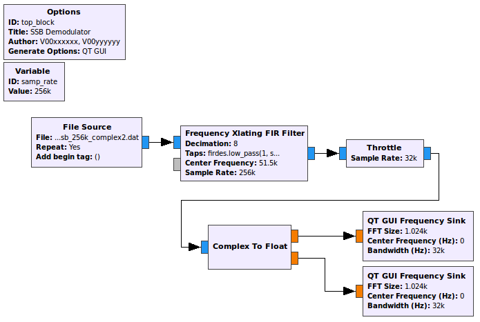
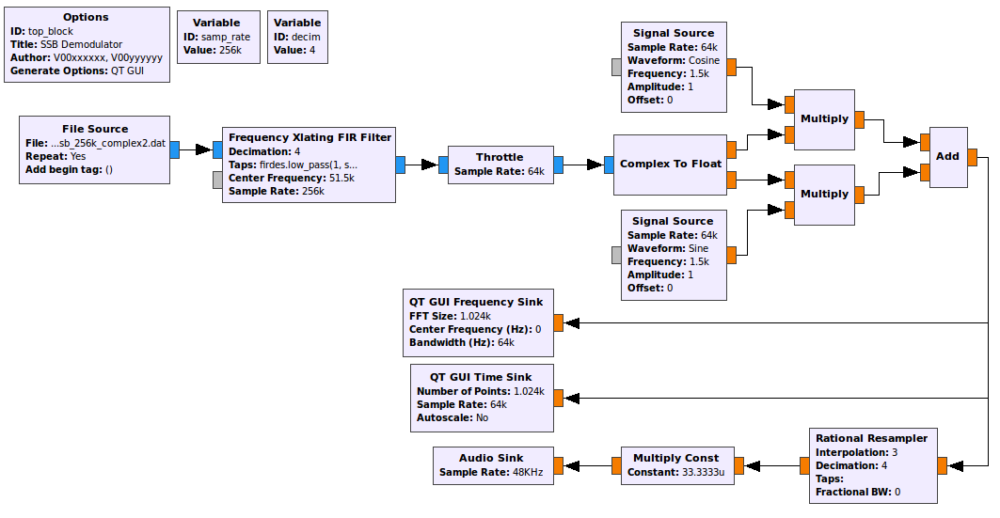

[**Back to Lab 2 Intro**](introduction.md) | [**Begin Part 2**](part1.md)

## Objectives

This tutorial is a guide to receiving SSB signals. It will also illustrate some of the properties of complex (analytic) signals and show why we use them in communications systems. In this tutorial you will:

<!-- - Use the discrete Hilbert transform to create a complex signal from a real signal. -->
- Use a frequency-translating filter to perform filtering and tuning in one step.
- Construct an SSB demodulator using Weaver's Method.

---

## Part 1 Deliverables
<!-- #TODO -->

- Two GRC files of SSB demodulators. You will be stepped through building them.
- There is 1 question in this part. It is clearly indicated.
  - The question requires approximately 1 line of writing, and addresses a concept, not details. Answer the question and submit a single page containing the answers to your TA at the end of the lab.

---

## Complex/Analytic Signals

- Review the [theory of analytic signals and SSB receivers](../_docs/pdriessen_textbook.pdf) (sections 2.3 and 3.4).

### Complex multiplication

- Create the a new flow graph as shown below. Make sure that all of the blocks are of type *Float*. This flow graph takes two sinusoids, at frequencies of 1 kHz and 10 kHz and multiplies them together. Using a trigonometric identity we know that the product of two cosines gives two cosines at the sum and difference frequencies of the original signals. In this case we expect outputs at 9 kHz (difference) and 11 kHz (sum).

   
  __*Flow graph with two multiplied sinusoidal inputs.*__

- Execute the flow graph and confirm this result. Note that the FFT plot shows both the positive and negative frequencies. We know that for real inputs the negative frequency components are the same as positive frequency components. Hover your mouse over the peaks to see that the frequencies are as expected (9 kHz and 11 kHz).

- Change ALL of the blocks to Type: *Complex* and execute the flow graph again. You should now observe a single output at 11 kHz. This is the original 10 kHz signal shifted by the 1 kHz signal. If we want to shift in the negative direction a frequency of -1000 can be used. Try this. From this example we see two of the primary advantages of using analytic signals. A signal can be shifted (sum) without creating an additional difference signal. Also, note that there are NO negative frequency components. **Why is this?**

- Remember what a complex signal looks like in the time domain, you will need to know this later in the lab.

- You can discard this flowgraph, it is not a deliverable.

## Single Sideband (SSB) Signal Weaver demodulator

In this section you will learn one technique for demodulating Single Sideband Signals. Section 2.3.7 of [the textbook](../_docs/pdriessen_textbook.pdf) shows the following images as illustrations of this technique. Familiarize yourself with them and their mathematical descriptions, you're going to build them!

   
  __*Block diagram for a real Weaver demodulator*__

   
  __*Block diagram for a complex Weaver demodulator*__

### Streaming the complex baseband data

- Download [this data file](data/ssb_lsb_256k_complex2.dat).

  - This data file was recorded by a USRP set to a center frequency of
50.3 MHz with a sample rate of 256 kHz.

- Create a new flow graph as shown below.
  - The *File Source* should be set to the data file that you just downloaded.
  - The *Variable* block which sets the sampling rate variable (`samp_rate`) should be set to 256000 as this is the data rate that the received signal was sampled at.
  - In the "Config" tab of the *QT GUI Frequency Sink*, set "Control Panel" to *Yes*.

   
  __*Flow graph with a file source input.*__

- This flowgraph will be your first deliverable. Save it as `SSB_demodulator.grc`, and in the *Options* block, set the following:

  - **Title:** SSB demodulator
  - **Author:** V00xxxxxx, V00yyyyyy (where all of your student numbers are included)

- Execute the flow graph. After the spectrum appears, adjust the *Ref Level*  and *Y Range* parameters so that the amplitude values range from -20 dB to 80 dB. You should view a section of the spectrum that is 256 kHz wide (due to the sample rate). Note that there is one signal visible between 40 and 60 kHz.

- When this signal was recorded, the USRP was set to a frequency of 50.3 MHz. Thus, the 0 kHz point on the display corresponds to 50.3 MHz.
  - While the FFT Plot is displayed move the cursor over the signal and note the frequency along its right edge. It should be approximately 53 kHz. Since this is a lower sideband (LSB) signal, this corresponds to the carrier frequency. Because the "zero" frequency corresponds to 50.3 MHz, the original carrier frequency of signal was 50.3 MHz + 53 kHz = 50.353 MHz. However, now that the spectrum has been shifted down by 50.3 MHz, we use the carrier frequency of 53 kHz.
  - The bandwidth of this LSB signal is 3 kHz.

### Frequency Translating Filter

The first step in building a receiver is to use a channel filter to pass the signal of interest and filter out the rest of the signals in the band. This is done as follows:

  1. First the signal of interest is shifted down to zero frequency as shown below.

        
       __*Signal shifting*__

  2. Next a low pass filter is applied so that the other signals will be filtered out as shown below.

        
       __*Signal shifting with a filter.*__

- In GRC, the *Frequency Xlating FIR Filter* performs both of these operations.

  - [Follow this link on the Frequency Xlating FIR Filter block](https://wiki.gnuradio.org/index.php/Frequency_Xlating_FIR_Filter) to review what the block is doing.

  - Add the block between the *File Source* and the *Throttle*.

  - Complete the properties window as shown below. The center frequency of 51500 will shift the entire spectrum down by 51500 Hz.
  > Note: The function indicated in the *Taps* parameter generates the taps for a low pass filter with a gain of 1 (in the pass band), a sampling rate equal to `samp_rate` (256 kHz), a cutoff frequency of 2 kHz and a transition width of 100 Hz.

   
  __*Frequency Xlating FIR Filter properties dialog.*__

- Execute the flow graph. You will see that your signal has now moved down to the origin and is the only signal present.

- Add a *Variable* block with:
  - ID: *decim*
  - Value: 4

- Now that we have located the signal of interest, there is no reason that we need to be concerned with so much of the adjacent spectrum. We can reduce the range of frequencies that are being processed by reducing the sample rate (decimation).
  - Re-open the *Frequency Xlating FIR Filter* block
    - Change the *Decimation* parameter to `decim`
    - Change the taps to `firdes.low_pass(1,samp_rate/decim, 2000,100)`
  - This will reduce the sample rate to **256000/4 = 64000 Hz**. Change the sample rate of the *Throttle* and *QT GUI Frequency Sink* to this new rate, using the `decim` variable. **What frequency range to you expect the FFT to display now?**

- Execute the flow graph again to see if you are correct. You should now observe an expanded version of your signal. Select *Autoscale* on the frequency plot so that the peaks of the signal are observed. Notice that after a while, the signal level will be reduced for a few seconds. That occurs when the station stops transmitting.

### Using the firdes module

In the previous step, we used the firdes module of GNU Radio. For more information on this tool, [check out the documentation](https://www.gnuradio.org/doc/doxygen/classgr_1_1filter_1_1firdes.html#details).

This module is used for generating finite impulse response (FIR) filters in GNU Radio. There are a number of filters available that can be explored in the API Reference link above. Some of the commonly used filters are listed below. The basic usage format is
`firdes.filter_type(args)` where `filter_type(args)` is one of:

- `band_pass(gain, sampling_freq, low_cutoff_freq, high_cutoff_freq, transition_width)`

- `band_reject(gain, sampling_freq, low_cutoff_freq, high_cutoff_freq, transition_width)`

- `complex_band_pass(gain, sampling_freq, low_cutoff_freq, high_cutoff_freq, transition_width)`

- `high_pass(gain, sampling_freq, cutoff_freq, transition_width)`

- `low_pass(gain, sampling_freq, cutoff_freq, transition_width)`

This list indicates the minimum number of arguments required for the filter to be generated. Each filter can also take an argument for the **type of window** it uses and the **beta value**. Additionally, each of these filter types has a "_2" version (ie: `band_pass_2`, `low_pass_2`). These versions take an extra parameter which specifies the stop band attenuation in dB. It is worthwhile to familiarize yourself with the usage of this module as it will be used again in these labs.

### Frequency multiplication

Recall that the signal is a complex (analytic) signal. One method of demodulating SSB voice is to operate on the real and imaginary parts of the signal separately. The [Complex to Float](https://wiki.gnuradio.org/index.php/Complex_To_Float) block will take a complex signal and output its real and imaginary parts as two separate float streams.

> Note: If you hover your mouse over the output ports of any blocks, they display the label for that data stream. In the case of a *Complex to Float* block, it will display which is real and which is imaginary.

- Modify the flow graph to appear as shown below. The outputs of the *Complex to Float* block are both real so the *QT GUI Frequency Sinks* need to be changed to Type: *Float*. Remember to change the sampling rate of the second sink to match the first.

   
  __*Flow graph with a complex input and filtering scheme, but real outputs.*__

- Execute the flow graph. You should now observe the spectra of the real and imaginary parts of the signal. Note that the signals extend out to 2 kHz, the cutoff frequency of the filter.

- One method of demodulating this SSB voice signal, known as Weaver's method, takes the real and imaginary part of the signal and processes them as shown below.

   
  __*Weaver demodulation.*__

  - Use the *Signal Source* in GRC to generate the cosine and sine waves needed to implement this demodulator.
    - Pay special attention to the *Frequency* and *Sample Rate* parameters. They will **need to be changed**.
      - *Frequency*: See above figure
      - *Sample Rate*: Remember the decimation factor. What is the sampling rate at this point in the flow graph?
    - The *Multiply* and *Add* blocks can be found in the *Math Operators* category.

- Observe the output of the *Add* block using a *QT GUI Frequency sink*. This is the baseband signal that has been extracted from the modulated SSB signal.

- The final step is to listen to the demodulated signal. Add an *Audio Sink* to the output float stream.

  - Recall that you will need to adjust the sampling rate to one that works with the *Audio Sink*. At this point in the flowgraph, your sampling rate is still **`samp_rate/decim` = 64000 Hz**. Use the *Rational Resampler* block to make the sampling rate at the audio sink **48 000 Hz**.
    - In the Rational Resampler block, set the Type to *Float->Float (Real Taps)*.

- You will also need a multiplier to reduce the amplitude of the signal before it enters the *Audio Sink*.

  - Find a suitable value by first observing the maximum peak on a *QT GUI Time Sink* and using the reciprocal of this value as the multiplier.
  - Use a *Multiply Const* block with this value between the *Rational Resampler* and the *Audio Sink* blocks.

- Test your SSB receiver; you should hear a voice.

- At this point your functioning flowgraph should look like the following figure.

   
  __*SSB flowgraph*__

- Save this GRC file for submission.

### Complex Weaver demodulator

The Weaver demodulator can also be implemented entirely with complex signals.

- Make a copy of `SSB_demodulator.grc` and name it `SSB_complex_demodulator.grc`. You can do this by going ***File -> Duplicate*** then ***File -> Save*** in GRC.
  - In the *Options* block change the title to be "SSB Complex Demodulator".
  - This file will be your second deliverable.

- Edit this SSB receiver to use only complex signals, with a *Complex To Real* block just before the audio sink.

  - There will now only be a single complex *Signal Source* block multiplied with the output of the *Throttle* block
    - Remembering that the float multiplication resulted in both a positive and a negative frequency component. Complex multiplication only results in a single frequency component. Change the frequency of this cosine to be -1500 Hz.
  - No *Add* block is needed.
  - Change the *Rational Resampler* block Type to *Complex->Complex (Complex Taps)*

- Test this receiver and confirm that it works in the same way as the receiver using real signals. It should look like the following figure.

   
  __*SSB complex flowgraph*__

Remember that taking the real part of the complex signal is the same thing as adding the negative frequencies! To illustrate this, add two *QT GUI Frequency Sinks*, one before and one after the *Complex To Real* block. Title them appropriately ("Complex" and "Real") and execute the flowgraph. It should look like the following image.

   
  __*SSB complex vs real spectra*__

---

#### Deliverable Question 1

Why does taking the *real* part of a complex signal result in frequencies being *added* to the spectrum?

---

- Change the *File Source* block to a *Wav File Source* block

- Download [this data file](./data/SDRSharp_20130920_3500kHz_IQ.wav) and point the *Wav File Source* block at it.

  - Modify the block properties as shown below.
  
     
    __*WAV File Source properties dialog.*__

  - This WAV file was recorded using the I and Q streams for the L and R channels. By setting the block to have two output channels you will be able to use the full I/Q signal.
  - Add a [Float To Complex](https://wiki.gnuradio.org/index.php/Float_To_Complex) block to convert from I and Q to a complex signal.

    - Cross the streams from the *Wav File Source* block into the *Float To Complex* block
  
       
      __*WAV file output streams*__

  - The WAV file was captured at 48 kHz so change `samp_rate` to 48 kHz
  - No decimation is necessary anymore, so change `decim` to 1
  - You can remove the *Rational Resampler* block after the complex *Multiply* block.

- There are two SSB voice signals in this file, both are upper sideband (USB), whereas the first data file was lower sideband (LSB). The Weaver demodulator needs some small modification to work with USB.

  - The complex multiply was shifting the centered LSB signal **down** by 1.5 kHz. It now needs to shift the centered USB signal **up** by 1.5 kHz. Implement this.
    > Hint: Refer to [the diagram above](./figures/part1_weaver_demod.png) illustrating the Weaver demodulator and now consider using the upper sideband.
  - One of the center frequencies in this file is 3500 Hz. Adjust the *Frequency Xlating FIR Filter* block to this. Also change the lowpass filter cutoff frequency to 1000 Hz.
  - Use the *QT GUI Time Sink* block to find the maximum amplitude and adjust the volume controlling *Multiply Const* block as before.

- Your flowgraph should look like the following

     
    __*SSB demodulator for 48 kHz WAV file*__

- Execute the flowgraph and listen. Add a *QT GUI Range* block to control the center frequency and try to find the other USB transmission captured in the file! 

<!-- #TODO Remove at a future date or reintegrate -->
<!-- - A data file taken using a software receiver with a wire antenna about 6 meters above the ground is found [here](./data/SDRSharp_20130919_004154Z_14053kHz_IQ.wav).
  - Change the Wav File Source to read this file, and test your receiver using this file.
  - The file contains mostly Morse code signals, no voice signals. Replace the fixed offset of 1500 Hz with a variable and control it with a WX GUI Slider. **What happens when the slider is moved and why?**
  - Replace the fixed bandwidth of the firdes module with a variable and control it with a Slider. For receiving Morse code signals, a bandwidth of 50-200 Hz is best. -->

<!-- Save this flowgraph. You can modify it for use with the RTL-SDR receiver
and listen to live Morse code and SSB signals in the frequency range
24.9-25.0 MHz, 27-29 MHz, 50.0-50.2 MHz. These frequencies will
propagate over long distances via the ionosphere for some (not all) of
the time. Other frequencies are 144.0-144.3 MHz and 145.8-146.0 MHz. -->

<!-- #TODO add hilbert version -->
---

At this point, you should have:

- two GRC files
  - `SSB_demodulator.grc`
  - `SSB_complex_demodulator.grc`

## Deliverables

From this part of the lab keep the following files to submit to your TA after the second (and final) part:

- `SSB_demodulator.grc`
- `SSB_complex_demodulator.grc`

- The answer to [Question 1](#deliverable-question-1)

**Do not attach the `top_block.py` to your submission.**

---
[**Back to Lab 2 Intro**](introduction.md) | [**Continue to Part 2**](part2.md)
