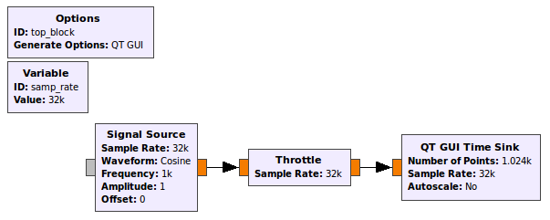
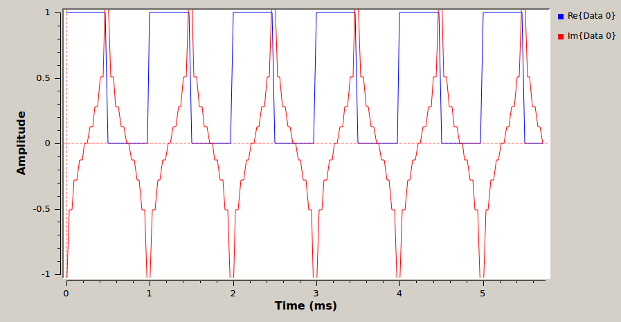

[**Back to Lab 2 Intro**](introduction.md) | [**Begin Part 2**](part2.md)

## Objectives

This tutorial is a guide to receiving SSB signals. It will also illustrate some of the properties of complex (analytic) signals and show why we use them in communications systems. In this tutorial you will:

- Use the discrete Hilbert transform to create a complex signal from a real signal.
- Use a frequency-translating filter to perform filtering and tuning in one step.
- Construct an SSB demodulator using Weaver's Method.

---

## Part 1 Deliverables
<!-- #TODO -->

- GRC files of AM transmitter and waveform builder. You will be stepped through building them.
- There are 2 questions spaced throughout this part. They are clearly indicated.
  - Each question requires approximately 1 line of writing, and address concepts, not details. Answer the questions and submit a single page containing the answers to your TA at the end of the lab.

---

## Complex/Analytic Signals

- Review the [theory of analytic signals and SSB receivers](../_docs/pdriessen_textbook.pdf) (sections 2.3 and 3.4).

### Hilbert Transforms

- Open a new flow graph in GRC. Create the simple flow graph shown. Set the *Type* in each of the three blocks to *Float* as you have in the past. Other than that you can leave all of the values at their default settings.

   
  __*Flow graph with simple input and throttled output.*__

- Execute the flow graph. The scope sink should open and display a sinusoidal signal. Convince yourself that this signal has the amplitude and frequency that you expect.

- Modify the flow graph by changing the *Type* in each of the three blocks to *Complex*. Execute the flow graph. Your scope plot should now display two sinusoids that are 90° out of phase with each other. The leading (*Re{Data 0}*) wave is the I or in-phase component of the complex signal and the lagging (*Im{Data 0}*) wave is the Q or quadrature component. When a signal source is set to *Complex*, it will output both the I and Q components.

- Modify your flow graph as shown below. The *Signal Source* should be set to output a Square wave with a Type of Float. Thus, the first *Scope Sink* and the *Throttle* must also be set to accept Float values.

   
  __*Flow graph with square waveform input and Hilbert filter.*__

- The [Hilbert](https://wiki.gnuradio.org/index.php/Hilbert) block is found in the *Filters* category. This block outputs both the real input signal and the Hilbert transform of the input signal as a complex signal. Leave the number of taps at its default setting of 65. Since the output of this block is complex, the second *Scope Sink* must be set to accept complex inputs.

- Execute the flow graph. Two scope plots should open. One should contain the square wave output from the *Signal Source* only. The other should include both the original square wave and its Hilbert Transform, as below.

   
  __*Output of Hilbert filtered square waveform in time domain*__

---

#### Deliverable Question 1

Why does the Hilbert transform of a square wave look this way?

---

- The *Signal Source* can be set to output a complex signal and display both the I and Q components. Modify the flow graph as shown below.

   
  __*Flow graph with a complex square wave input.*__

- Set the *Signal Source* to output a complex waveform. Make sure the *Throttle* and *Scope Sink* are also set to complex.

- Execute the flow graph. **Is the complex waveform displayed here the same as the one obtained from the Hilbert transform?** Your answer should be NO. This is incorrect. GRC is NOT displaying the correct Q component of a complex square wave. The Hilbert transform did output the proper waveform.

   
  __*Complex square wave in time domain.*__

- You can discard this flowgraph, it is **not** for submission.

### Complex multiplication

<!-- #TODO add math? -->
- Create the a new flow graph as shown below. Make sure that all of the blocks are of type *Float*. This flow graph takes two sinusoids, at frequencies of 1 kHz and 10 kHz and multiplies them together. Using a trigonometric identity we know that the product of two cosines gives two cosines at the sum and difference frequencies of the original signals. In this case we expect outputs at 9 kHz (difference) and 11 kHz (sum).

   
  __*Figure 2.4: Flow graph with two multiplied sinusoidal inputs.*__

- Execute the flow graph and confirm this result. Note that the FFT plot shows both the positive and negative frequencies. We know that for real inputs the negative frequency components are the same as positive frequency components. Hover your mouse over the peaks to see that the frequencies are as expected (9 kHz and 11 kHz).

- Change ALL of the blocks to Type: *Complex* and execute the flow graph again. You should now observe a single output at 11 kHz. This is the original 10 kHz signal shifted by the 1 kHz signal. If we want to shift in the negative direction a frequency of -1000 can be used. Try this. From this example we see two of the primary advantages of using analytic signals. A signal can be shifted (sum) without creating an additional difference signal. Also, note that there are NO negative frequency components. **Why is this?**

- You can discard this flowgraph, it is not a deliverable.

## Single Sideband (SSB) Signal demodulator

In this section you will learn one technique for demodulating Single Sideband Signals. [This data file](data/ssb_lsb_256k_complex2.dat) will be used.

This data file was recorded by a USRP set to a center frequency of
50.3 MHz with a sample rate of 256 kHz.

- Create a new flow graph as shown below.
  - The *File Source* should be set to the data file that you just downloaded.
  - The *Variable* block which sets the sampling rate variable (`samp_rate`) should be set to 256000 as this is the data rate that the received signal was sampled at.
  - In the "Config" tab of the *QT GUI Frequency Sink*, set "Control Panel" to *Yes*.

   
  __*Flow graph with a file source input.*__

- This flowgraph will be your first deliverable. Save it as `SSB_demodulator.grc`, and in the *Options* block, set the following:

  - **Title:** SSB demodulator
  - **Author:** V00xxxxxx, V00yyyyyy (where all of your student numbers are included)

- Execute the flow graph. After the spectrum appears, adjust the *Ref Level*  and *Y Range* parameters so that the amplitude values range from -20 dB to 80 dB. You should view a section of the spectrum that is 256 kHz wide (due to the sample rate). Note that there is one signal visible between 40 and 60 kHz.

- When this signal was recorded, the USRP was set to a frequency of 50.3 MHz. Thus, the 0 kHz point on the display corresponds to 50.3 MHz.
  - While the FFT Plot is displayed move the cursor over the signal and note the frequency along its right edge. It should be approximately 53 kHz. Since this is a lower sideband (LSB) signal, this corresponds to the carrier frequency. Because the "zero" frequency corresponds to 50.3 MHz, the original carrier frequency of signal was 50.3 MHz + 53 kHz = 50.353 MHz. However, now that the spectrum has been shifted down by 50.3 MHz, we use the carrier frequency of 53 kHz.
  - The bandwidth of this LSB signal is 3 kHz.
  <!-- - #TODO are they always? -->

### Frequency Translating Filter

The first step in building a receiver is to use a channel filter to pass the signal of interest and filter out the rest of the signals in the band. This is done as follows:

  1. First the signal of interest is shifted down to zero frequency as shown below.

        
       __*Signal shifting*__

  2. Next a low pass filter is applied so that the other signals will be filtered out as shown below.

        
       __*Signal shifting with a filter.*__

- In GRC, the *Frequency Xlating FIR Filter* performs both of these operations.

  - [Follow this link on the Frequency Xlating FIR Filter block](https://wiki.gnuradio.org/index.php/Frequency_Xlating_FIR_Filter) to review what the block is doing.

  - Add the block between the *File Source* and the *Throttle*.

  - Complete the properties window as shown below. The center frequency of 51500 will shift the entire spectrum down by 51500 Hz.
  > Note: The function indicated in the *Taps* parameter generates the taps for a low pass filter with a gain of 1 (in the pass band), a sampling rate equal to `samp_rate` (256 kHz), a cutoff frequency of 2 kHz and a transition width of 100 Hz.

   
  __*Frequency Xlating FIR Filter properties dialog.*__

- Execute the flow graph. You will see that your signal has now moved down to the origin and is the only signal present.

- Now that we have located the signal of interest, there is no reason that we need to be concerned with so much of the adjacent spectrum. We can reduce the range of frequencies that are being processed by reducing the sample rate (decimation).
  - Re-open the *Frequency Xlating FIR Filter* block
    - Change the *Decimation* parameter to 4
    - Change the taps to `firdes.low_pass(1,samp_rate/4, 2000,100)`
    <!-- - #TODO should it just be samp_rate -->
  - This will reduce the sample rate to **256000/4 = 64000 Hz**. Change the sample rate of the *Throttle* and *QT GUI Frequency Sink* to this new rate. **What frequency range to you expect the FFT to display now?**

- Execute the flow graph again to see if you are correct. You should now observe an expanded version of your signal. Select *Autoscale* on the frequency plot so that the peaks of the signal are observed. Notice that after a while, the signal level will be reduced for a few seconds. That occurs when the station stops transmitting.

### Using the firdes module

In the previous step, we used the firdes module of GNU Radio. For more information on this tool, [check out the documentation](https://www.gnuradio.org/doc/doxygen/classgr_1_1filter_1_1firdes.html#details).

This module is used for generating finite impulse response (FIR) filters in GNU Radio. There are a number of filters available that can be explored in the API Reference link above. Some of the commonly used filters are listed below. The basic usage format is
`firdes.filter_type(args)` where `filter_type(args)` is one of:

- `band_pass(gain, sampling_freq, low_cutoff_freq, high_cutoff_freq, transition_width)`

- `band_reject(gain, sampling_freq, low_cutoff_freq, high_cutoff_freq, transition_width)`

- `complex_band_pass(gain, sampling_freq, low_cutoff_freq, high_cutoff_freq, transition_width)`

- `high_pass(gain, sampling_freq, cutoff_freq, transition_width)`

- `low_pass(gain, sampling_freq, cutoff_freq, transition_width)`

This list indicates the minimum number of arguments required for the filter to be generated. Each filter can also take an argument for the **type of window** it uses and the **beta value**. Additionally, each of these filter types has a "_2" version (ie: `band_pass_2`, `low_pass_2`). These versions take an extra parameter which specifies the stop band attenuation in dB. It is worthwhile to familiarize yourself with the usage of this module as it will be used again in these labs.

### Weaver demodulator

Recall that the signal is a complex (analytic) signal. One method of demodulating SSB voice is to operate on the real and imaginary parts of the signal separately. The [Complex to Float](https://wiki.gnuradio.org/index.php/Complex_To_Float) block will take a complex signal and output its real and imaginary parts as two separate float streams.
> Note: If you hover your mouse over the output ports of any blocks, they display the label for that data stream. In the case of a *Complex to Float* block, it will display which is real and which is imaginary.

- Modify the flow graph to appear as shown below. The outputs of the *Complex to Float* block are both real so the *QT GUI Frequency Sinks* need to be changed to Type: *Float*. Remember to change the sampling rate of the second sink to match the first.

   
  __*Flow graph with a complex input and filtering scheme, but real outputs.*__

- Execute the flow graph. You should now observe the spectra of the real and imaginary parts of the signal. Note that the signals extend out to 2 kHz, the cutoff frequency of the filter.

- One method of demodulating this SSB voice signal, known as Weaver's method, takes the real and imaginary part of the signal and processes them as shown below.

   
  __*Weaver demodulation.*__

  - Use the *Signal Source* in GRC to generate the cosine and sine waves needed to implement this demodulator.
    - Pay special attention to the *Frequency* and *Sample Rate* parameters. They will **need to be changed** to match the figure below and the sampling rate (remember the decimation) at this point in the flow graph, respectively.
    - The *Multiply* and *Add* blocks can be found in the *Math Operators* category.

- Observe the output of the *Add* block using a *QT GUI Frequency sink*. This is the baseband signal that has been extracted from the modulated SSB signal.

- The final step is to listen to the demodulated signal. Add an *Audio Sink* to the output float stream.
  - Recall that you will need to adjust the sampling rate to one that works with the *Audio Sink*. At this point in the flowgraph, your sampling rate is still **`samp_rate/4` = 64000 Hz**. Use the *Rational Resampler* block to make the sampling rate at the audio sink **48 000 Hz**.
    - In the Rational Resampler block, set the Type to *Float->Float (Real Taps)*.

- You will also need a multiplier to reduce the amplitude of the signal before it enters the *Audio Sink*.
  - Find a suitable value by first observing the maximum peak on a *QT GUI Time Sink* and using the reciprocal of this value as the multiplier.
  - Use a *Multiply Const* block with this value between the *Rational Resampler* and the *Audio Sink* blocks.

- Test your SSB receiver; you should hear the voice.
  >Note: It may be helpful to add a *QT GUI Waterfall Sink* to aid in locating the signal of interest.

- At this point your functioning flowgraph should look like the following figure.

   
  __*SSB flowgraph*__

- Save this GRC file for submission.

### Complex Weaver demodulator

The Weaver demodulator can also be implemented entirely with complex signals.

- Make a copy of `SSB_demodulator.grc` and name it `SSB_complex_demodulator.grc`. You can do this by going ***File -> Duplicate*** in GRC.
  - In the *Options* block change the title to be "SSB Complex Demodulator".
  - This file will be your second deliverable.

- Edit this SSB receiver to use only complex signals, with a *Complex To Real* block just before the audio sink.

  - There will now only be a single complex *Signal Source* block multiplied with the output of the *Throttle* block
    - Remembering that the float multiplication resulted in both a positive and a negative frequency component, in the previous demodulator the audio was read from the negative portion. The now complex multiplication only results in a single frequency component. Change the frequency of this cosine to be -1500 Hz.
  - No *Add* block is needed.
  - Change the *Rational Resampler* block Type to *Complex->Complex (Complex Taps)*

- Test this receiver and confirm that it works in the same way as the receiver using real signals. It should look like the following figure and sound slightly better than the float version.

   
  __*SSB complex flowgraph*__

- Change the File Source block to a *Wav File Source*
- Test this receiver using [this data file](./data/SDRSharp_20130920_024052Z_14190kHz_IQ.wav). This is a WAV file! To read it in GNURadio:
  - Add a *Wav File Source* and modify its properties as shown below.
  - This WAV file was recorded using the I and Q streams for the L and R channels. By setting the block to have two output channels you will be able to use the full I/Q signal.
  - Add a [Float To Complex](http://www.ece.uvic.ca/~ece350/grc_doc/ar01s11s10.html) block to convert from I and Q to a complex signal.

   
  __*Figure 2.11: WAV File Source properties dialog.*__

- There are two SSB voice signals in this file, both are upper sideband (USB), whereas the first data file was lower sideband (LSB). The Weaver demodulator needs a small modification to work with USB.
  > Hint: Refer to the diagram above illustrating the Weaver Demodulator and now consider using the upper sideband.

- A data file taken using a software receiver with a wire antenna about 6 meters above the ground is found [here](./data/SDRSharp_20130919_004154Z_14053kHz_IQ.wav).
  - Change the Wav File Source to read this file, and test your receiver using this file.
  - The file contains mostly Morse code signals, no voice signals. Replace the fixed offset of 1500 Hz with a variable and control it with a WX GUI Slider. **What happens when the slider is moved and why?**
  - Replace the fixed bandwidth of the firdes module with a variable and control it with a Slider. For receiving Morse code signals, a bandwidth of 50-200 Hz is best.

Save this flowgraph. You can modify it for use with the RTL-SDR receiver
and listen to live Morse code and SSB signals in the frequency range
24.9-25.0 MHz, 27-29 MHz, 50.0-50.2 MHz. These frequencies will
propagate over long distances via the ionosphere for some (not all) of
the time. Other frequencies are 144.0-144.3 MHz and 145.8-146.0 MHz.

---

[**Continue to Tutorial 2**](tutorial2.md)
