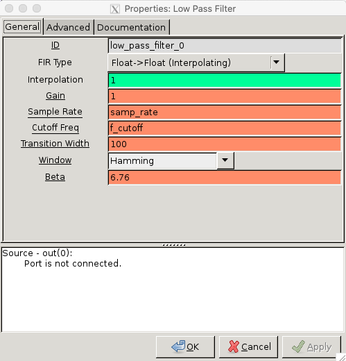
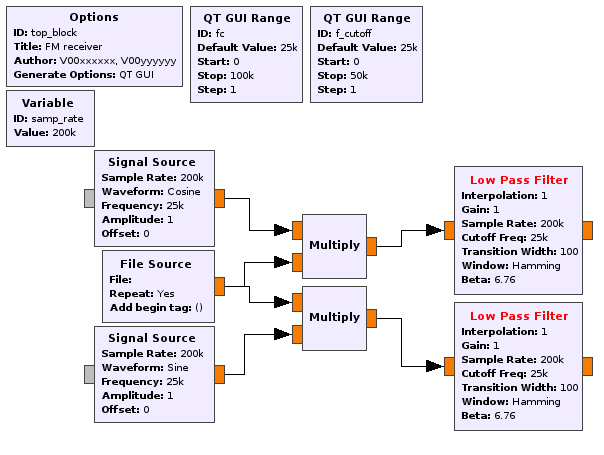

[**Back to Part 1**](FM-transmitter-simulation.md) | [**Begin Part 3**](FM-receiver-USRP.md)

## Objectives

This part of the lab is a guide to receiving FM signal waveforms. You
will:

- learn the theory and equations of FM signals, power spectra, bandwidths, and FM demodulation

- construct an FM receiver flowgraph to recover messages from an FM waveform

---

## Part 2 Deliverables
<!-- #TODO review -->

- Two GRC files of SSB demodulators. You will be stepped through building them.
- There is 1 question in this part. It is clearly indicated.
  - The question requires approximately 1 line of writing, and addresses a concept, not details. Answer the question and submit a single page containing the answers to your TA at the end of the lab.

---

You are going to build flowgraphs to receive FM signals that are simulation-only and do not (yet) use the USRP (that will come later in this lab!).

## Theory

- Review the theory of [FM Signals](../_docs/pdriessen_textbook.pdf) (section 5).
- Recall that a digital FM demodulator starts with the I and Q outputs of a general IQ receiver. For an FM signal,

    $$ s(t) = A_c cos \left( 2\pi f_c t + 2\pi k_f \int_{0}^{1} m(\alpha )d\alpha \right) $$

    $$ I(t) = A_c cos \left( 2\pi k_f \int_{0}^{1} m(\alpha )d\alpha \right) $$

    $$ Q(t) = A_c sin \left( 2\pi k_f \int_{0}^{1} m(\alpha )d\alpha \right) $$

- To extract $$ m(t) $$ from $$ I(t) $$ and $$ Q(t) $$, consider them as a complex signal.

  $$
  \begin{align*}
      s(t) &= Re \{ a(t) e^{j\phi (t)} e^{j2\pi f_c t} \} \\

      &= Re \{ [ I(t) + j Q(t) ] e^{j2\pi f_c t}\} \\

      &= Re \{ s(t) e^{j2\pi f_c t } \}
  \end{align*}
  $$

  where,
  
  $$
  \begin{align*}
      \tilde{s}(t) &= I(t) + jQ(t) \\
      &= a(t) e^{j\phi (t) }
  \end{align*}
  $$

- It can be shown that $$ m(t) $$ is obtained from the following formula:

  $$ m(t) = arg[ \tilde{s}(t-1) \tilde{s}^{*} (t) ] $$

  where,

  $$ (t-1) \rightarrow z^{-1} $$

  represents one sample delay.

  >**Proof**:
  >$$
  >\\
  >\begin{align*}
  >    arg[ \tilde{s}(t-1)\tilde{s}^{*} (t) ] &= arg[ a(t-1) e^{j\phi (t-1)} a(t)e^{-j\phi (t)} ] \\
  >    &= \phi (t-1)- \phi (t) \\
  >    &\approx \frac{d\phi}{dt} \\
  >    &\approx 2\pi k_f m(t) 
  >\end{align*}
  >$$

## Building an FM receiver

You'll start by receiving your sinusoidal message. The equations for this are shown in the [theory section](#theory) above.

- Start GRC and change the default sampling rate to be 200 kHz.

- This flowgraph will be a deliverable. Save it as `FM_receiver.grc`, and in the *Options* block, set the following:

  - **Title:** FM receiver
  - **Author:** V00xxxxxx, V00yyyyyy (where all of your student numbers are included)

- Add a *QT GUI Range* for $$ f_c $$
  - Set it to range from 0-100 kHz with a default value of 25 kHz.

- Start by adding a *File Source* block and pointing it to the `FM_TX_2kHz_sine.dat` file generated by your transmitter.
  - Remember to make the *Output Type: Float* since it was saved as a float stream
  - The output of this block is $$ s(t) $$

- Multiply $$ s(t) $$ by the cosine and sine of the carrier frequency.
  - The frequency must be the same as the carrier used to transmit the message
  - Each multiplication will result in two low and two high frequency components

    $$ cos(\alpha)cos(\beta) = \frac{\left( cos(\alpha + \beta) + cos(\alpha - \beta) \right)}{2} $$

    $$ sin(\alpha)cos(\beta) = \frac{\left( sin(\alpha + \beta) + sin(\alpha - \beta) \right)}{2} $$

  - Use a low pass filter to omit the higher frequencies and keep the baseband signal
    - Add a *QT GUI Range* block to control the cutoff frequency of the filter.
      - Set the default value to be 25 kHz with a range from 0 to 50 kHz
      - The block parameters should look like the following figure.

          
         __*Low pass filter parameters*__

- The flowgraph should now look like the following.

   
  __*Flow graph after filtering*__

- Use a *Float To Complex* block to combine $$ I(t) $$ and $$ Q(t) $$ and produce the complex baseband signal $$ \tilde{s} = I(t) + j Q(t) = a(t) e^{ej\phi (t)} $$

- You can add a *QT GUI Frequency Sink* to see the baseband signal after filtering. It should look like the following figure.

   
  __*Spectrum after filtering*__

- Implement $$ m(t) = arg[ \tilde{s}(t-1) \tilde{s}^{*} (t) ] $$ from the [theory section](#theory) to extract the message from the baseband signal.
  - You will need a [Delay](https://wiki.gnuradio.org/index.php/Delay) block with the *Delay* property set to 1. This delays every sample that enters the block by 1 sample.
  - You will also need one of each a [Multiply Conjugate](https://wiki.gnuradio.org/index.php/Multiply_Conjugate) block and a [Complex to Arg](https://wiki.gnuradio.org/index.php/Complex_to_Arg) block.
  - **Try to do this without looking at the figure of the final flowgraph below. Interpret the math and implement it by using the mentioned blocks.**

- Add a **QT GUI Time Sink** and a **QT GUI Frqeuency Sink** to the output to view the demodulated message.

- The flowgraph should now look like the following figure.

   
  __*FM receiver flowgraph*__

- Execute the flowgraph. You should see the demodulated 2 kHz sine wave in the output spectrum and time scope.

   
  __*Demodulated sine message, $$ m(t) $$ in time domain*__

   
  __*Demodulated sine message, $$ m(t) $$ in frqeuency domain*__

- Switch the input file to be `FM_TX_2kHz_square.dat`. You should clearly be able to read the `1010...` FSK sequence

   
  __*Demodulated FSK message, $$ m(t) $$ in time domain*__

   
  __*Demodulated FSK message, $$ m(t) $$ in frqeuency domain*__

- Save this GRC file now, it is a deliverable.

---

At this point, you should have:

- one GRC file
  - `FM_receiver.grc`

## Deliverables

From this lab part, keep the following for later submission to your TA:

- `FM_receiver.grc`
<!-- - The answer to [Question 1](#deliverable-question-1) -->

**Do not attach the `top_block.py` or `.dat` files.**

---

[**Back to Part 1**](FM-transmitter-simulation.md) | [**Begin Part 3**](FM-receiver-USRP.md)
