[**Back to Lab 3 Intro**](introduction.md) | [**Begin Part 2**](FM-receiver-simulation.md)

## Objectives

This part of the lab is a guide to transmitting FM signal waveforms. You
will:

- learn the theory and equations of FM signals, power spectra, bandwidths, and FM modulation

- construct an FM transmitter flowgraph to generate an FM waveform with both a sinusoidal message and a square wave message

---

## Part 1 Deliverables
<!-- #TODO review -->

- One GRC file of an FM transmitter. You will be stepped through building it.
- There is 1 question in this part. It is clearly indicated.
  - The question requires approximately 1 line of writing, and addresses a concept, not details. Answer the question and submit a single page containing the answers to your TA at the end of the lab.

---

You are going to build flowgraphs to transmit FM signals that are simulation-only and do not (yet) use the USRP (that will come later in this lab!).

## Theory

- Review the theory of [FM Signals](../_docs/pdriessen_textbook.pdf) (section 5).
- Recall that for a sinusoidal modulating wave,

    $$ m(t) = A_{m}cos\left( 2\pi f_m t\right) $$

  the FM wave can be written as:
  
    $$
    \begin{align*}
        s(t) &= A_{c}cos\left( 2\pi f_c t + \beta sin \left(2\pi f_m t \right) \right) \\

        &= Re \{ A_c e^{j(2\pi f_c t + \beta sin(2\pi f_m t))} \} \\

        &= Re \{ A_c e^{j\beta sin(2\pi f_m t)} e^{j2\pi f_c t} \} \\

        &= Re \{ \tilde{s}(t) e^{j2\pi f_c t} \} \\

        &= Re \{ s^{+}(t) \} \\
    \end{align*}
    $$

### Exploring the *Phase Mod* block

How do you transmit a *real* signal (we'll call it $$ \phi $$) as *complex* ($$ e^{j\phi} $$) in GNU Radio? Let's explore.

- Open a new GNU Radio Companion flowgraph.

- Add a *QT GUI Range* block and set its parameters as follows:
  - *ID:* `phi`
  - *Default Value:* 0
  - *Start:* -3.14
  - *Stop:* 3.14
  - *Step:* 0.01

- Add a *Constant Source* block and set it's *Constant* to be `phi`, the variable from the *QT GUI Range* block. Make sure that the block type is *Float*.

- Add a *Throttle* block of type *Float*

- Add a *QT GUI Constellation Sink* and notice that it can only accept complex numbers!

- Your flowgraph should look like the following figure. The output of the float line is a signal, $$ \phi $$, and we need the input of the IQ plane to be $$ e^{j\phi} $$.

    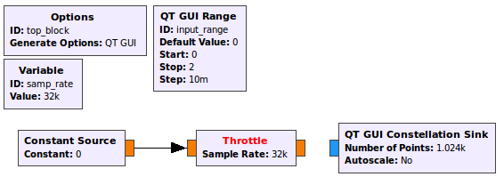 
    __*Flowgraph of a real signal unable to be connected to a complex sink*__

- Add a [Phase Mod](https://wiki.gnuradio.org/index.php/Phase_Mod) block.
  - Read the documentation on the block to understand what it is doing.
  - Notice the sensitivity parameter. Set it to be 1.

- The input of the *Phase Mod* block is some GUI controlled number between $$ -\pi $$ and $$ \pi $$. The *Phase Mod* block output is $$ e^{jx\pi} $$ where $$ x $$ is the sensitivity parameter.
  > Notice the $$ j $$ in the above equation, and also notice the way in which the sensitivity parameter can be used.

- The flowgraph should now look like the following figure.

    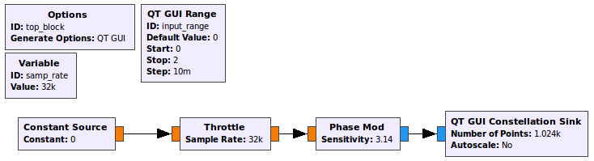 
    __*Flowgraph of a real signal being transmitted as a complex signal*__

- Execute the flowgraph. You should see a small dot hovering around $$ I = 1, Q = 0 $$ which is $$ e^{j\phi} $$ where $$ \phi = 0 $$.
- As you move the slider from $$ -\pi \rightarrow \pi $$, you are changing $$ \phi $$ from $$ -\pi \rightarrow \pi $$.

- You may discard this flowgraph, it is not a deliverable. However, remember how the *Phase Mod* block works. You will need to use it later.

## Building an FM transmitter for a sine message

You'll start by transmitting a sinusoidal message. The equations for this are shown in the [theory section](#theory) above.

- Start GRC and change the default sampling rate to be 500 kHz.

- This flowgraph will be your first deliverable. Save it as `FM_transmitter.grc`, and in the *Options* block, set the following:

  - **Title:** FM transmitter
  - **Author:** V00xxxxxx, V00yyyyyy (where all of your student numbers are included)

- From the equations above, create some variables controlled with sliders.
  - Add a *QT GUI Range* for each of $$ f_m $$, $$ f_c $$ and $$ \beta $$.
  - For the message frequency, range from 0-10 kHz with a default value of 5 kHz.
  - For the carrier frequency, range from 0-100 kHz with a default value of 25 kHz.
  - For the beta value, range from 0-10 with a default value of 4, and a step size of 0.025.

- Begin by using a *Signal Source* block and a *Multiply Const* block to create the $$ \beta sin( 2\pi f_m t) $$ term.
  - In the signal source, change the *Output Type* to *Float*, and the *Waveform* to *Sine*.
  - Use the variables from the *QT GUI Range* widgets for $$ \beta $$ and $$ f_m $$.

- This flowgraph will not be used to transmit to any hardware, so a *Throttle* block is needed. Add a *Throttle* after the *Multiply Const* block.

- In order to turn this signal into a complex exponential, we must take $$ e^{j\phi} $$ where $$ \phi $$ is the signal at this point.
  - Use the [Phase Mod](https://wiki.gnuradio.org/index.php/Phase_Mod) block as you did [earlier in this lab](#exploring-the-phase-mod-block).
  - Notice that we could input the $$ \beta $$ value as the sensitivity instead of using the *Multiply Const* block. If you choose to keep the *Multiply Const* block, set the *Sensitivity* parameter to 1.

- The flow graph should now look like the following figure.

    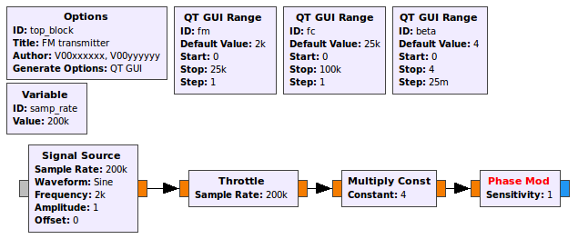 
    __*Graphical representation of $$ e^{j\beta sin(2\pi f_m t)} $$*__

- Now construct the second exponential, $$ e^{j2\pi f_c t} $$ and multiply them together to create $$ s^{+}(t) $$.
  - Use a *Signal Source* block in conjunction with a *Multiply* block and incorporate the *QT GUI Range* variable for $$ f_c $$.

- Use a *Complex To Real* block to obtain $$ s(t) $$.
  > Notice that $$ A_c $$ is not used and so is equal to 1.

- Visualize the output of the flowgraph using a:
  - *QT GUI Time Sink* at $$ m(t) $$
  - *QT GUI Time Sink* at $$ s(t) $$
  - *QT GUI Frequency Sink* at $$ s(t) $$
  > As always, you are free to use the *QT GUI Tab Widget* to organize the GUI however you like. If you need a refresher on how to use this tool, it is covererd in the [intro tutorials](../_intro/introduction.md).

- The flowgraph should now look like the following figure

  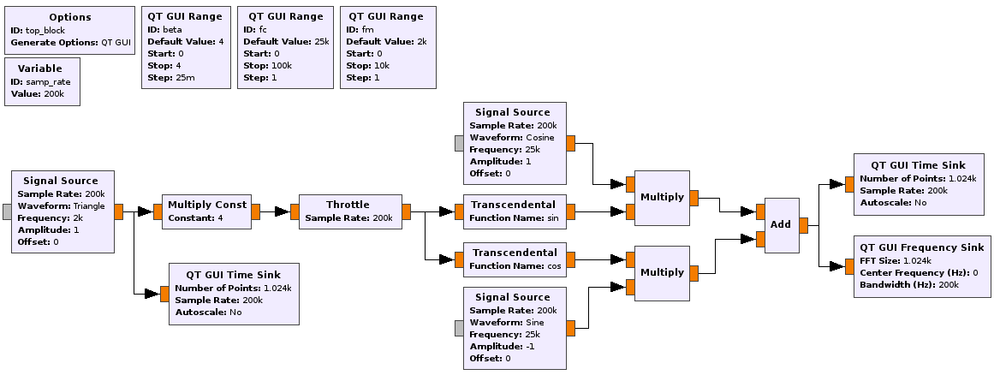 
  __*Flowgraph of a FM transmitted sine message*__

- Leaving default values unchanged, the output should look like the following figures.
  
  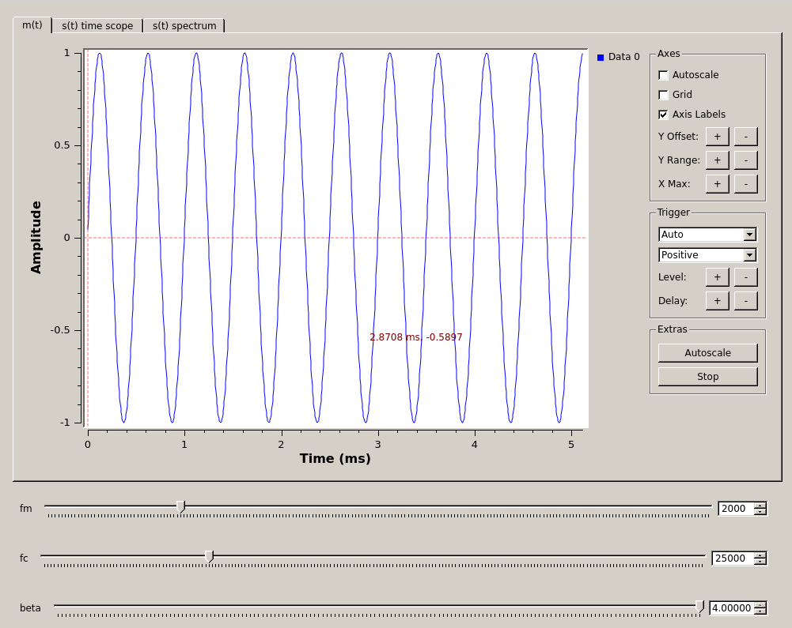 
  __*$$ m(t) $$ with default values in time domain*__

  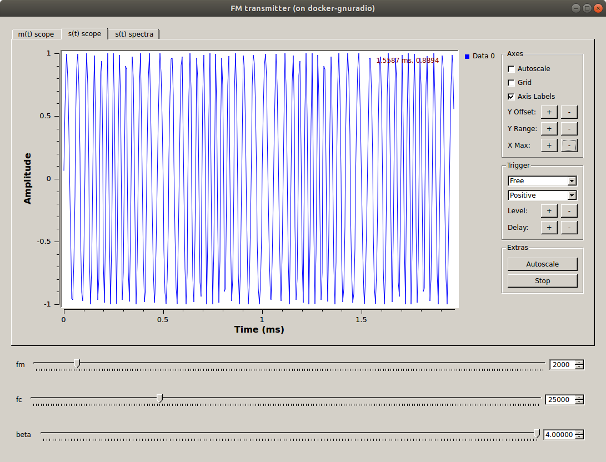 
  __*$$ s(t) $$ with default values in time domain*__

  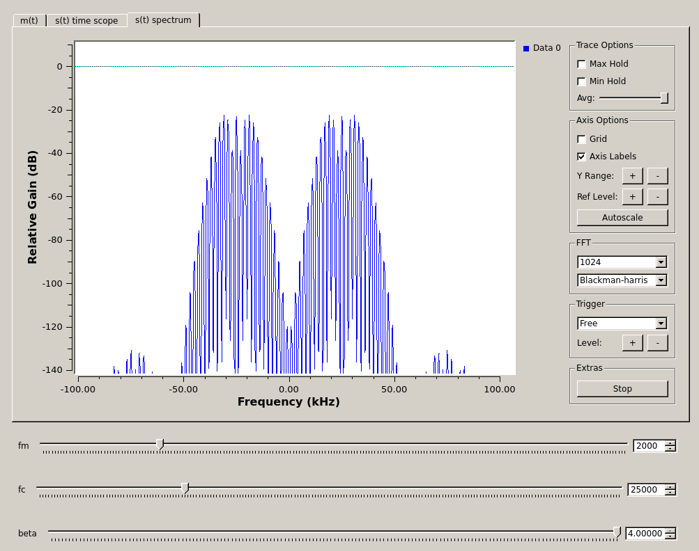 
  __*$$ s(t) $$ with default values in frequency domain*__

- Experiment with adjusting the three sliders.

- Reset $$ f_c $$ to 25 kHz and $$ f_m $$ to 5 kHz.

  - Measure the amplitude of the carrier wave and of the first sideband.

    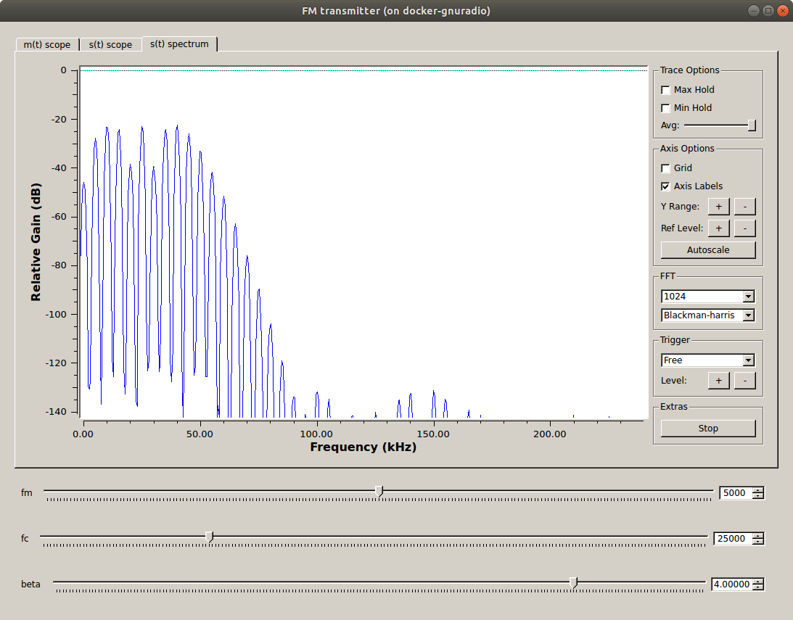 
    __*Positive half of spectrum only to more clearly measure Bessel peaks*__

---
#### Deliverable Question 1

Show that the Bessel peaks have the correct values relative to each other. In other words, confirm that for the chosen vlaue of $$ \beta $$, the carrier wave and first sideband have the correct values relative to eachother as described by the following equation.

$$ \Delta P = 20 log\frac{J_1(\beta)}{J_0(\beta)} $$

You will want to reference a [table of Bessel functions](https://www.statisticshowto.datasciencecentral.com/wp-content/uploads/2017/01/bessel-tables.pdf) or use a Bessel calculator (built into Matlab/Python/most mathematical programming languages).

---

- Add a *File Sink* block to capture $$ s(t) $$ and save a file called `FM_TX_5kHz_sine.dat`. You will need to execute the flowgraph for a few seconds to build the file.

## Building an FM transmitter for an FSK message

Up until now the transmitted message has been a sine wave of frequency $$ f_m $$. You will now simulate transmitting a Frequency Shift Keying (FSK) signal by transmitting a square waveform (which is an FSK pattern of `101010...`).

The integral of a square waveform is a triangular waveform with the same frequency as the square waveform. So for frequency modulation with a square wave, we can skip doing the integral and simply use a triangular waveform.

- Change the *Signal Source* block to output a triangular waveform of frequency $$ f_m $$.

- With the *File Sink* block disabled, execute the flowgraph and observe the various plots. Adjust the sliders so that $$ f_m $$ is 2 kHz see how it impacts the transmitted signal.

- The following figures show $$ m(t)$$  and $$ s(t) $$ with a message frequency of 2 kHz.

  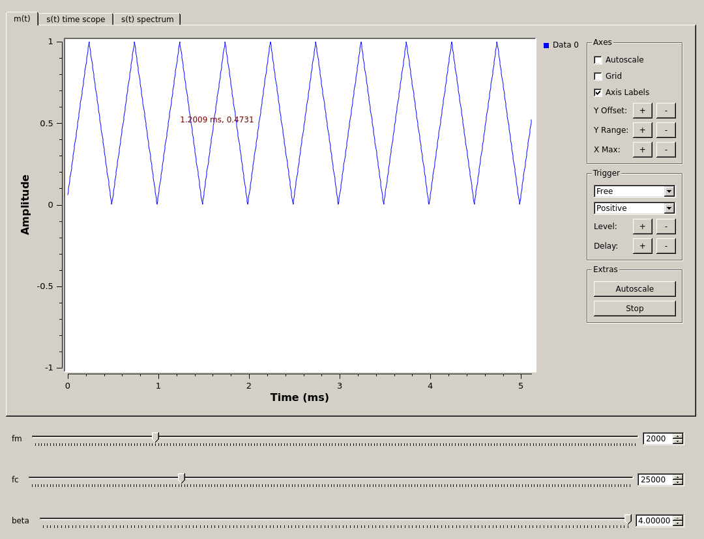 
  __*$$ m(t) $$ with default values in time domain*__

  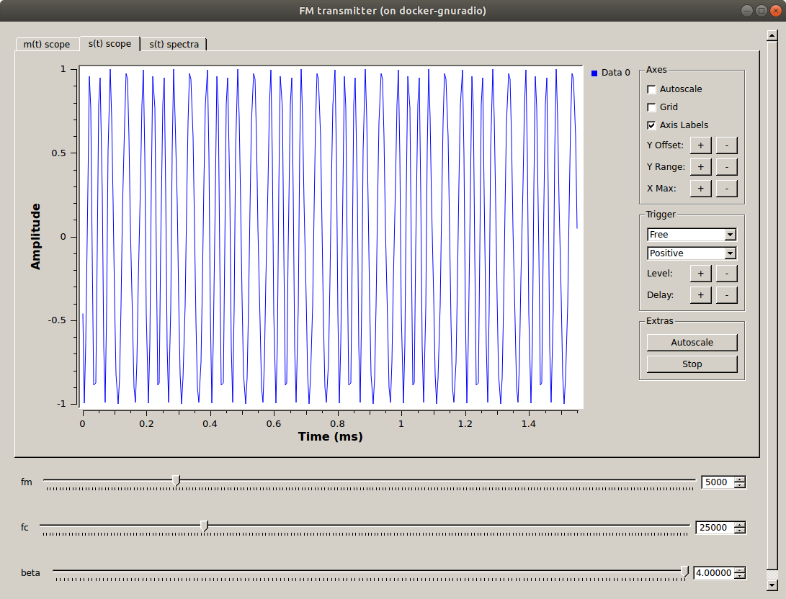 
  __*$$ s(t) $$ with default values in time domain*__

  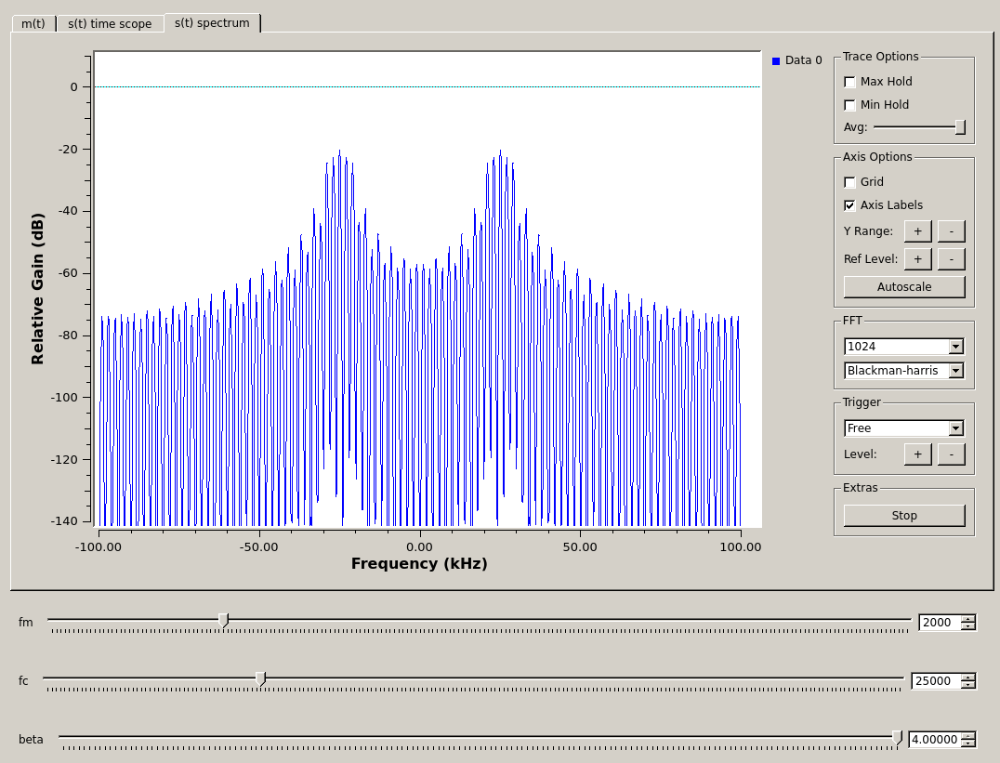 
  __*$$ s(t) $$ with default values in frequency domain*__

> Note that the sidebands for FSK with a square wave message (`101010...`) do not follow the Bessel function values as they do for a sine wave message.

- Set the sliders back to default values.

- Enable the *File Sink* block and save a file called `FM_TX_5kHz_square.dat`. You will need to execute the flowgraph for a few seconds to build the file.

- Save this GRC file now, it is a deliverable.

---

At this point, you should have:

- one GRC file
  - `FM_transmitter.grc`
- 2 data files
  - `FM_TX_5kHz_sine.dat`
  - `FM_TX_5kHz_square.dat`

## Deliverables

From this lab part, keep the following for later submission to your TA:

- `FM_transmitter.grc`
- The answer to [Question 1](#deliverable-question-1)

**Do not attach the `top_block.py` or `.dat` files. You will use some of the `.dat` files in the next part though, so don't delete them yet!**

---

[**Back to Lab 3 Intro**](introduction.md) | [**Begin Part 2**](FM-receiver-simulation.md)
