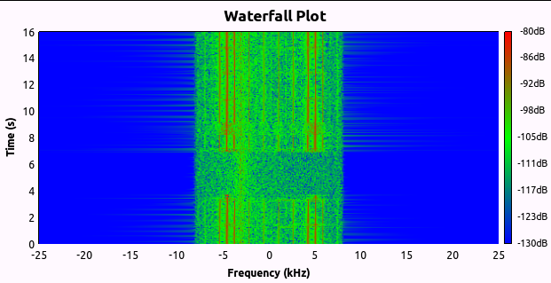

# Lab 3 - FLEX Frame Synchronizer

In this section, you will capture some frames from the
[FLEX](http://en.wikipedia.org/wiki/FLEX_(protocol)) pager network and
locate the frame synchronization word. The sync word allows the decoder
to synchronize with the beginning of the message bits. A standard method
for detecting the sync word is to correlate the incoming signal against
the sync word.

You will also try to decode some of the message bits.

Review the theory on [Frame Synchronization](./data/FrameSync.pdf).
Further description of frame synchronization is in the text *CR Johnson,
WA Sethares, Software Receiver Design, Cambridge, 2011*chapter 8,
section 8.5.

## Deliverables

- Working flowgraph showing how the FLEX frames were captured.

- Code which prints out the start time of each sync word found in a file.

- A list of the 16 frame times that you extracted from the test file.

- A list of the frame times that you extracted from a file you captured of the air.

- A description of your observations about the FLEX protocol and the approach you would take to decode actual message text.

- Identifying two different FSK signals and measuring their symbol rates.

## Frame Capture

There is a relatively strong FLEX pager network signal around 929.66
MHz. The FLEX signal is multi-level Frequency-Shift Keying, so an FM
demodulator is needed to detect the data.

- Create a flowgraph to receive this signal, starting with the IQ receiver from the previous section with a waterfall added.

- Set the USRP receive gain high (30dB), tune your receiver to this frequency and view the signal on the waterfall display. You may need to use the *Autoscale* function on the waterfall for a better view.
    > Note: If you are not able to find the FLEX signal, there is a [FLEX file source](./data/FLEX_bits.wav) that can be used instead. This file is the demodulated FLEX signal. It can be observed in your flowgraph using a *Scope Sink*, but does not require any further processing from Gnu Radio Companion. If using this file, you may skip to Section 4.3

- What do you observe? With some patience, you should periodically see two strong lines that are 9.6 kHz apart with other weaker lines on either side (harmonics) as shown in [Fig. 3.1](#figure-3.1:-flex-waterfall). 9.6 kHz is the frequency shift used by the FLEX signal. The signal actually switches rapidly between the two frequencies, although the resolution of the waterfall is not fine enough to show this detail.

 
 **Figure 3.1: Flex waterfall**

- You may also observe that the paging signal occurs in shorter bursts, as shown in [Fig. 3.2](#figure-3.2:-another-flex-waterfall).
  ##### Figure 3.2: Another Flex waterfall

- Although FLEX can use a variety of modulation schemes, the sync word is always sent as 2-level FSK at 1600 bits per second. Create an FM discriminator just as you did in the previous lab to demodulate the FLEX signal.

- View the demodulated output on the scope. You should now see what looks like a digital waveform as shown in [figure\_title](#flex_bits).

- Save the demodulated output to a file in one of the following ways:
  1. In binary format using a *File Sink* at any sample rate. This file can be read in MATLAB using the [fread](http://www.mathworks.com/help/matlab/ref/fread.html) function or in any other language of your choice.
  2. In WAV format using a *Wav File Sink* at one of the accepted sample rates for WAV files (48 kHz is suggested). WAV files can be read in MATLAB using the [wavread](http://www.mathworks.com/help/matlab/ref/wavread.html) function or viewed in Audacity.

## Bit and Frame Sync

- To find the location of the marker sequence in this data waveform stored in a file requires two steps:
  1. find the bit stream from the waveform
  2. find the marker in the bit stream

- The bit stream can be found from the waveform by visual inspection of the waveform. In the example waveform in [figure\_title](#flex_bits) of the previous subsection, the data bits are
 0011110110110101010010010
 where we have written 0 instead of -1 for convenience.

- A good way to examine visually examine the file from Section 4.2 is to open it in Audacity (note that this is only possible for a WAV file). It is also possible in Matlab, although it is worse for visual inspection.

- To determine a bitstream by computer requires a bit more thought. In this case, since the USRP is phase locked to GPS, there is an integer number of samples per bit, which makes the waveform-to-bits conversion much easier. One method to find the locations of the sync word by computer is as follows:
  1. Visually examine the file either in Audacity or in Matlab to determine the location of the first sync word. The sync word you should look for in this case is 0xA6C6AAAA or the 32-bit sequence:
     - 1010 0110 1100 0110 1010 1010 1010 1010
  2. Either copy/paste in Audacity or create a new array in Matlab to isolate the sync word.
  3. Now the isolated sync word needs to be cross-correlated against the entire bitstream. If you are confident in your ability to do this programatically you can write your own program to do this either in Matlab or the language of your choice. Otherwise, you may use the following Matlab script:
     - [frame\_sync.m](data/frame_sync.m)

You should now have a list of times for when each syncword starts. If you were able to create your own file in Section 4.2, you can visually determine whether the start times are correct,and adjust your code if they are not.

If you were using the previously generated[FLEX\_bits.wav](./data/FLEX_bits.wav), it contains 16 frames, with the first one starting at 0.7126 seconds and the last one starting at 30.7126 seconds.

> How much time between frames (sync words)? Is there any larger pattern?

## Decoding text

- Try to decode some text, the letters and numbers are not encrypted. Some hints may be found [here](http://scholar.lib.vt.edu/theses/available/etd-10597-161936/unrestricted/THESIS.PDF) , pages 4-11.
    >Note: It is not expected that successful decoding can be completed during the lab period, however, the approach you would take with your TA.

## Other data signals

A data file, [fsk.dat](./data/fsk.dat), was recorded at a sample rate of 48 kHz containing complex samples of two FSK signals. One signal is at an offset of -10 kHz while the other is at +15 kHz. One signal has two tones while the other uses eight tones.

- Use a complex *File Source* block to read the file and your FM discriminator from the previous section to demodulate the signals one at a time.

- For each signal, determine:
  - Which signal is at which offset?
  - What is the symbol rate of each signal?

- The demodulated two-tone signal should look similar to the one in [figure\_title](#fsk2level).

- The demodulated eight-tone signal should look similar to the one in [figure\_title](#fsk8level).

[**Continue to Lab 4**](../_lab4/lab4.md)
