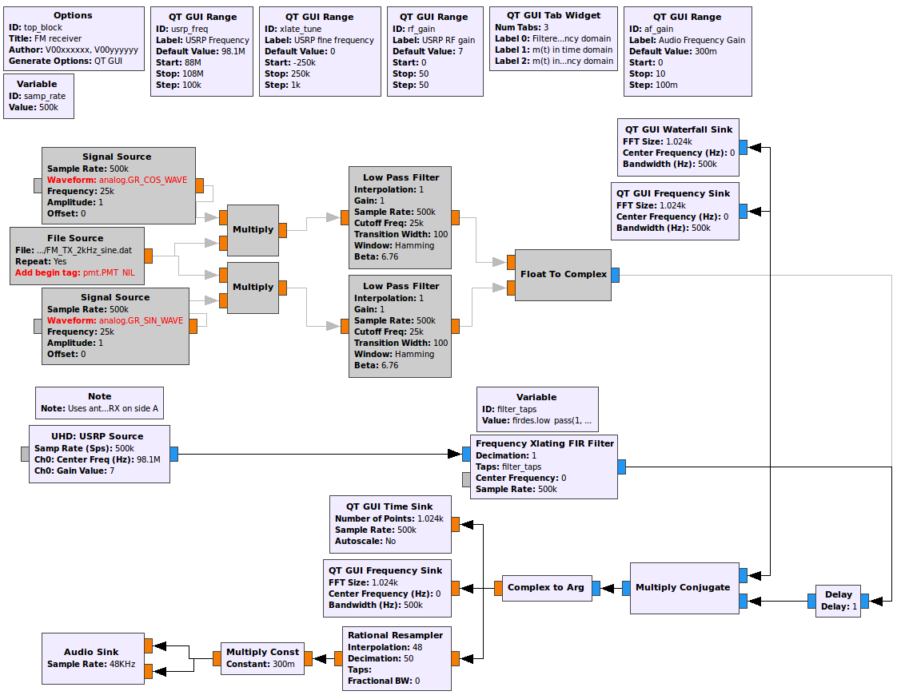

[**Back introduction**](introduction.md) | [**Begin Part 2**](FLEX-sync.md)

## Objectives

This part of the lab is a guide to measuring bit rates of real FSK signals. In it you will:

- use the flowgraph constructed during the past lab to demodulate an FSK signal and measure its bit rate

---

## Part 2 Deliverables
<!-- #TODO review -->

<!-- - One GRC files of an FM receiver. You will be stepped through building it. -->
- There is 1 question in this part. It is clearly indicated.
  - The question requires approximately 1 line of writing, and will generally address a concept. Answer the question and submit a single page containing the answers to your TA at the end of the lab.

---

## FM data receiver

- Open your FM receiver from the last lab. It was titled `FM_receiver.grc`. It should look like the following figure.

   
  __*Previously build FM receiver*__

- Execute the flowgraph and tune to the 2-level FSK signal at 142.17 MHz. This signal is the control channel for the [CREST public safety radio system](http://www.crest.ca/).

   
  __*Waterfall of CREST FSK*__

The bandwidth of this signal is about 25 kHz compared to the 200 kHz for FM broadcast signals.

- Edit the *Variable* block which sets the `filter_taps`. Change the cutoff frequency to THIS and the transition width to THIS.

- Edit the *Frequency Xlating FIR Filter* block and set the decimation rate to 4.
    - Change every block after the filter that uses `samp_rate` to use "`samp_rate`/4" instead.

- Observe the demodulator output using the *QT GUI Time Sink*. The filter bandwidth and decimation rate may require adjustment, since the bandwidth of this CREST signal is about 25 kHz compared to 200 kHz for FM broadcast signals.

- Check the persistence box on the scope and reduce the alpha to minimum. You will observe a so-called [eye diagram](http://en.wikipedia.org/wiki/Eye_pattern) of the data, as shown below. The eye diagram shows the number of milliseconds per bit. Find the bit rate (the number of bits per second).

   
  __*Eye diagram of the data shown in a GNU Radio Companion scope sink.*__

---

#### Deliverable Question 1

What is the bit rate of the control channel for the CREST public safety radio system?

---
